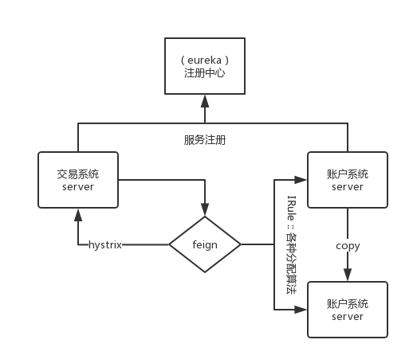

> ### SpringCloud HelloWorld



> 搭建一个服务注册中西 ( `eureka` )

> 导入 `pom` 依赖

```xml
<!-- Spring Cloud支撑包 -->
<dependencyManagement>
    <dependencies>
        <dependency>
            <groupId>org.springframework.cloud</groupId>
            <artifactId>spring-cloud-starter-parent</artifactId>
            <version>Edgware.SR3</version>
            <type>pom</type>
            <scope>import</scope>
        </dependency>
    </dependencies>
</dependencyManagement>
```

> 导入: `Eureka`

```xml
<!-- Eureka依赖 -->
<dependency>
    <groupId>org.springframework.cloud</groupId>
    <artifactId>spring-cloud-starter-eureka</artifactId>
</dependency>

<!-- Eureka服务依赖 -->
<dependency>
    <groupId>org.springframework.cloud</groupId>
    <artifactId>spring-cloud-starter-eureka-server</artifactId>
</dependency>

<!--web项目依赖 -->
<dependency>
    <groupId>org.springframework.boot</groupId>
    <artifactId>spring-boot-starter-web</artifactId>
</dependency>
```

> 在`application.properties`文件中配置

```properties
#端口
server.port=7070
#应用名称
spring.application.name=registerCore
#实例所在地址
eureka.instance.hostname=localhost
#是设置eureka服务器所在的地址，查询服务和注册服务都需要依赖这个地址
eureka.client.serviceUrl.defaultZone=http://localhost:7070/eureka/
#registerWithEureka表示是否注册自身到eureka服务器，因为当前这个应用就是eureka服务器，没必要注册自身，所以这里是false
eureka.client.registerWithEureka=false
#fetchRegistry表示是否从eureka服务器获取注册信息
eureka.client.fetchRegistry=false
```

> 在SpringBoot启动类中添加 `@EnableEurekaServer`

```java
//开启eureka服务注册中心
@EnableEurekaServer
//表示为springboot应用程序
@SpringBootApplication
public class ServerManagerApplication {

	public static void main(String[] args) {
		SpringApplication.run(ServerManagerApplication.class, args);
	}

}
```

> 启动 `main` 程序开启服务注册中心

---

> 构建一个`server`服务

> 导入 `pom` 配置

```xml
<!-- Spring Cloud支撑包 -->
<dependencyManagement>
    <dependencies>
        <dependency>
            <groupId>org.springframework.cloud</groupId>
            <artifactId>spring-cloud-starter-parent</artifactId>
            <version>Edgware.SR3</version>
            <type>pom</type>
            <scope>import</scope>
        </dependency>
    </dependencies>
</dependencyManagement>
```

> 添加`dependencies`依赖

```xml
<!-- 配置Eureka依赖 -->
<dependency>
    <groupId>org.springframework.cloud</groupId>
    <artifactId>spring-cloud-starter-eureka</artifactId>
</dependency>

<!-- 配置web依赖 -->
<dependency>
    <groupId>org.springframework.boot</groupId>
    <artifactId>spring-boot-starter-web</artifactId>
</dependency>
```

> 添加`application.properties`配置

```properties
#端口
server.port=7071
#服务名称
spring.application.name=payServer
#是设置Eureka地址，服务启动将注册到这个Eureka上面
eureka.client.serviceUrl.defaultZone=http://localhost:7070/eureka/
#实例名称在Eureka上面可以看到
eureka.instance.appname=payServer
```

> 在SpringBoot启动类中添加`@EnableEurekaClient`

```java
//开启Spring Boot
@SpringBootApplication
//开启Eureka配置，将此服务注册到eureka注册中心
@EnableEurekaClient
public class ServerApplication {

	public static void main(String[] args) {
		new SpringApplicationBuilder(ServerApplication.class).web(true).run(args);
	}

}
```

> 启动 `main` 程序开启服务并向注册中心发送心跳

---

> 设置`服务` 向 `注册中心` 发送心跳的时长

```properties
#eureka 客户端需要多长时间发送心跳给eureka服务器，表明他仍然或者，默认30秒
eureka.instance.lease-expiration-duration-in-seconds=20
#eureka 服务器在接受到实力的最后一次发出的心跳后，需要等待多久才可以将此实力删除
eureka.instance.lease-renewal-interval-in-seconds=10
```

> `服务注册中心`配置

```properties
#开启自我保护模式
eureka.server.enable-self-preservation=false

#清理无效节点,默认60*1000毫秒,即60秒
eureka.server.eviction-interval-timer-in-ms=5000
```

