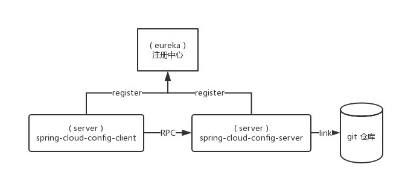
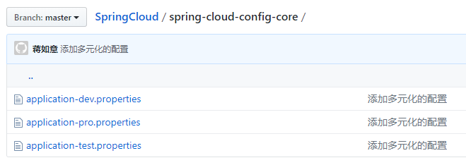

> ## SpringCloud config git

1. 在`gitHub`中创建项目并存放配置文件
2. 搭建一个`注册中心`
3. 搭建一个`服务`与`git`仓库进行连接
4. 搭建一个`服务`通过仓库连接服务调用配置文件

> 架构图



> 在`gitHub`中创建项目并存放配置文件



> #### 搭建一个`注册中心` :: 服务注册中的地址

```properties
eureka.client.serviceUrl.defaultZone=http://localhost:7070/eureka/
```

> #### 搭建一个`服务`与`git`仓库进行连接

> 在 `pom` 文件中添加依赖

```xml
<dependency>
    <groupId>org.springframework.cloud</groupId>
    <artifactId>spring-cloud-config-server</artifactId>
</dependency>
```

> 添加`application.yaml`配置文件

```yaml
server:
  port: 8000

spring:
  application:
    name: spring-cloud-config-server
  cloud:
    config:
      server:
        git:
          uri: https://github.com/jiangruyi/SpringCloud.git
          search-paths: spring-cloud-config-core
          username: 2491920818@qq.com
          password: xxx

eureka:
  client:
    service-url:
      defaultZone: http://localhost:7070/eureka/
```

> 编写SpringBoot启动类

```java
@EnableConfigServer
@EnableDiscoveryClient
@SpringBootApplication
public class Application {

	public static void main(String[] args) {
		new SpringApplicationBuilder(Application.class).web(true).run(args);
	}

}
```

> #### 搭建一个`服务`通过仓库连接服务调用配置文件

> 添加 `pom` 依赖

```xml
<dependency>
    <groupId>org.springframework.cloud</groupId>
    <artifactId>spring-cloud-starter-config</artifactId>
</dependency>
```

> 编写 bootstrap.yaml 配置文件

```yaml
spring:
  cloud:
    config:
      uri: http://localhost:8000/
      name: application
      profile: dev
      label: master

server:
  port: 9000
```

> ```yaml
> discovery:
> 	enabled: true
> 	service-id: serverId/** 获取配置的服务ID*/
> 
> basedir: nativeDir/** SprignCloud 配置拉到本地的位置*/
> ```

> `spring.cloud.config.uri` :: 与git连接的`服务`地址

> 编写基本配置文件 `application.yaml`

```yaml
spring:
  application:
    name: config-client-git

server:
  port: 9000

eureka:
  client:
    service-url:
      defaultZone: http://localhost:7070/eureka/
```

> 编写 SpringBoot 启动类读取git上的配置文件

```java
@EnableDiscoveryClient
@SpringBootApplication
@RestController
public class Application {

	@Value("${com.znsd.config}")
	private String gitValue;
	
	public void setGitValue(String gitValue) {
		this.gitValue = gitValue;
	}
	
	@GetMapping("hello")
	public String hello () {
		return gitValue;
	}
	
	public static void main(String[] args) {
		new SpringApplicationBuilder(Application.class).web(true).run(args);
	}

}
```

---

> ### 配置热部署

> 在调用配置服务端 pom 文件中添加依赖

```xml
<dependency>
    <groupId>org.springframework.boot</groupId>
    <artifactId>spring-boot-starter-actuator</artifactId>
</dependency>
```

> 在要动态热部署的配置类中添加: `@RefreshScope` 注解

> 以 `POST` 方式访问`URL` `http://localhost:9000/refresh`刷新配置
>
> 注意:
>
> * 返回消息中包含: `Full authentication is required to access this resource.`
>   * 解决方案: 
>     * 将安全认证关掉: `management.security.enabled=false`
>     * 配置一个安全认证