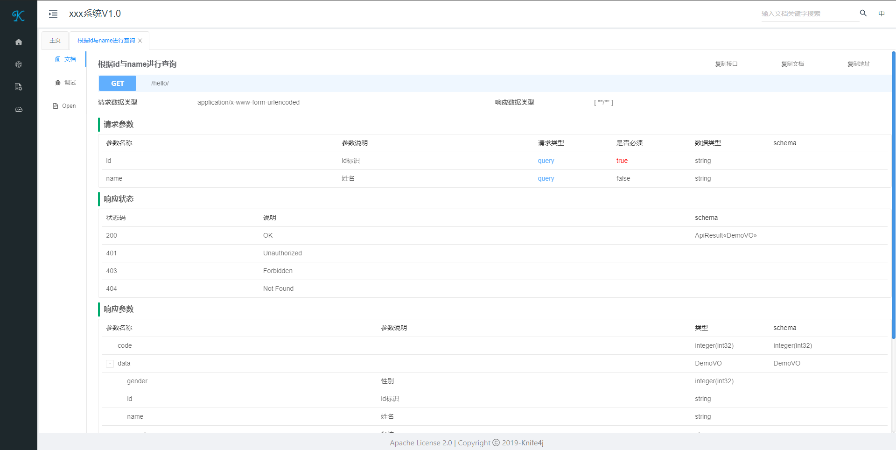

# Swagger3

> 导入pom

``` xml
<!--swagger, 内包含 springfox-swagger2,springfox-swagger-ui-->
<dependency>
    <groupId>io.springfox</groupId>
    <artifactId>springfox-boot-starter</artifactId>
    <version>3.0.0</version>
</dependency>
<!--swagger的ui 前身是swagger-bootstrap-ui-->
<dependency>
    <groupId>com.github.xiaoymin</groupId>
    <artifactId>knife4j-spring-boot-starter</artifactId>
    <version>3.0.2</version>
</dependency>
```

> 配置 application.properties

```properties
# 开启后可用的文档访问地址
# http://localhost:8080/doc.html
# http://localhost:8080/swagger-ui/index.html
springfox.documentation.enabled=true
knife4j.basic.enable=true
```

> 深度定制一些内容可添加配置类 ( 可选 )

```java
import org.springframework.beans.factory.annotation.Value;
import org.springframework.context.annotation.Bean;
import org.springframework.context.annotation.Configuration;
import org.springframework.context.annotation.Profile;
import springfox.documentation.builders.ApiInfoBuilder;
import springfox.documentation.builders.PathSelectors;
import springfox.documentation.builders.RequestHandlerSelectors;
import springfox.documentation.service.ApiInfo;
import springfox.documentation.service.Contact;
import springfox.documentation.spi.DocumentationType;
import springfox.documentation.spring.web.plugins.Docket;

@Configuration
//@Profile({"dev"}), 也可以通过这个来控制 docket.enable 的这属性
public class Swagger2Config {

    @Value("${springfox.documentation.enabled:false}")
    private boolean enable;

    @Bean
    public Docket createRestApi() {
        return new Docket(DocumentationType.SWAGGER_2).enable(enable).apiInfo(apiInfo()).select()
                .apis(RequestHandlerSelectors.basePackage("com.example.swagger.controller")).paths(PathSelectors.any()).build();
    }

    private ApiInfo apiInfo() {
        return new ApiInfoBuilder().title("xxx系统V1.0").description("后台api接口")
                .termsOfServiceUrl("").contact(new Contact("", "", "")).version("1.0").build();
    }

}
```

> 注解使用小案例

* controller

```java
@RestController
@Api(tags = "hello")
@RequestMapping("hello")
public class HelloController {
    
@GetMapping
@ApiOperation(value = "根据id与name进行查询")
public ApiResult<DemoVO> getByForm(@Valid DemoForm form, BindingResult bindingResult){}

}
```

* DemoForm

```java
@Data
public class DemoForm {

    @NotBlank(message = "预警ID不能为空")
    @ApiModelProperty(value = "id标识", notes = "自增", required = true)
    private String id;

    @ApiModelProperty(value = "姓名", notes = "张三")
    private String name;

}
```

* DemoVO

```java
@Data
public class DemoVO {

    @ApiModelProperty(value = "id标识", notes = "自增", required = true)
    private String id;

    @ApiModelProperty(value = "姓名", notes = "张三")
    private String name;

    @ApiModelProperty(value = "性别", notes = "0女,1男")
    private Integer gender;

    @ApiModelProperty(value = "备注", notes = "张三这个老弟不一般")
    private String remarks;

}
```

> http://localhost:8080/doc.html 页面




>  报错原因

因为Springfox使用的路径匹配是基于AntPathMatcher的，而Spring Boot 2.6.X使用的是PathPatternMatcher。

> 解决

在配置文件(application.yaml）的配置里，加上下面这个：

```yaml
spring:
  mvc:
    pathmatch:
      matching-strategy: ant_path_matcher
```