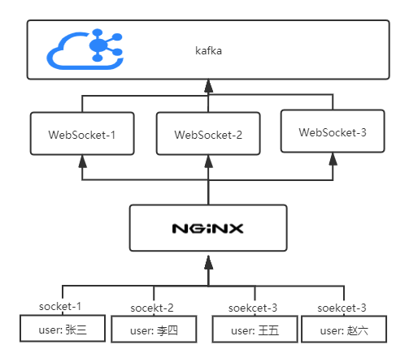

> #### WebSocket 在负载时通知全部消息



> maven 依赖

```xml
<dependency>
    <groupId>org.springframework.boot</groupId>
    <artifactId>spring-boot-starter-websocket</artifactId>
</dependency>

<dependency>
    <groupId>org.springframework.kafka</groupId>
    <artifactId>spring-kafka</artifactId>
</dependency>
```

> application.yaml 文件配置

```yaml
spring:
  kafka:
    #指定kafka server的地址，集群配多个，中间，逗号隔开
    bootstrap-servers: 172.16.10.210:9092
    producer:
      key-serializer: org.apache.kafka.common.serialization.StringSerializer
      value-serializer: org.apache.kafka.common.serialization.StringSerializer
    consumer:
      group-id: default_consumer_group #群组ID
      enable-auto-commit: true
      auto-commit-interval: 1000
      key-deserializer: org.apache.kafka.common.serialization.StringDeserializer
      value-deserializer: org.apache.kafka.common.serialization.StringDeserializer

doudio:
  kafka:
    WebSocketAllMsg: WEB_SOCKET_ALL_MSG
    groupId:
      WebSocketAllMsg: default
```

> WebSocket 业务实现

```java
import com.example.websocketcluster.util.SpringContextUtil;
import lombok.Data;
import lombok.extern.slf4j.Slf4j;
import org.springframework.kafka.core.KafkaTemplate;
import org.springframework.stereotype.Component;

import javax.websocket.*;
import javax.websocket.server.PathParam;
import javax.websocket.server.ServerEndpoint;
import java.io.IOException;
import java.util.Map;
import java.util.concurrent.ConcurrentHashMap;

@Slf4j
@Data
@Component
@ServerEndpoint(value = "/WebSocket/{token}")
public class WebSocketDemo {

    private static final ConcurrentHashMap<String, WebSocketDemo> webSocketMap = new ConcurrentHashMap<>();

    private Session session;

    @OnOpen
    /** 页面打开时 */
    public void onOpen(Session session, @PathParam("token") String token) {
        System.out.println(String.format("opOpen: {session: %s, token: %s}", session, token));
        webSocketMap.put(session.getId(), this);
        this.session = session;
    }

    @OnClose
    /** 页面关闭时 */
    public void onClose() {
        System.out.println(String.format("onClose: {this: %s}", this));
    }

    @OnMessage
    /** 监听消息 */
    public void onMessage(String message, Session session) {
        System.out.println(String.format("server and html: {message: %s, session: %s}", message, session));
        sendAllMsg(message);
    }


    @OnError
    /** 出现异常 */
    public void onError(Session session, Throwable error) {
        System.out.println(String.format("http href onError: {session: %s, error: %s}",
                session, error));
    }

    // 发送消息
    public void sendMessage(String message) {
        try {
            if (this.session.isOpen()) // 在发送消息时判断会话是否打开
                this.session.getBasicRemote().sendText(message);
        } catch (IOException e) {
            log.error(e.getMessage(), e);
        }
    }

    public void sendThisAllMsg(String message) {
        webSocketMap.entrySet().stream().forEach(e -> e.getValue().sendMessage(message));
    }

    public void sendAllMsg(String msg) {
        KafkaTemplate<String, String> kafkaTemplate = SpringContextUtil.getBeanByClass(KafkaTemplate.class);
        kafkaTemplate.send("WEB_SOCKET_ALL_MSG", msg);
    }

}
```

> 订阅topic发消息

```java
@Slf4j
@Component
public class WebSocketAllMsgSubscribe {

    @Autowired
    private WebSocketDemo webSocketDemo;

    @KafkaListener(topics = {"${doudio.kafka.WebSocketAllMsg}"}, groupId = "${doudio.kafka.groupId.WebSocketAllMsg}")
    public void warningDetailsListen(ConsumerRecord<?, ?> record) {
        webSocketDemo.sendThisAllMsg(String.valueOf(record.value()));
    }

}
```

> nginx 相关配置

```nginx
map $http_upgrade $connection_upgrade {
    default upgrade;
    ''      close;
}

upstream my_server {
    #ip_hash;
    server 127.0.0.1:9000;
    server 127.0.0.1:9001;
}

server {

    listen 80;
    server_name 172.16.10.210;

    #编码格式
    charset utf-8;

    location / {
        proxy_pass http://my_server;
        proxy_read_timeout 300s;
        proxy_set_header Host $host;
        proxy_set_header X-Real-IP $remote_addr;
        proxy_set_header X-Forwarded-For $proxy_add_x_forwarded_for;
        proxy_http_version 1.1;
        proxy_set_header Upgrade $http_upgrade;
        proxy_set_header Connection $connection_upgrade;
    }

}
```

