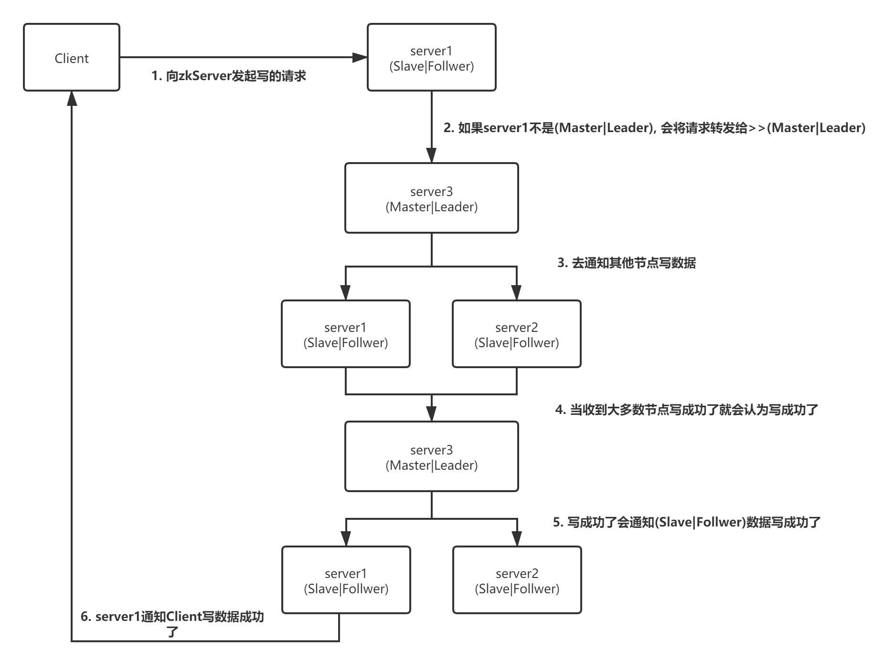
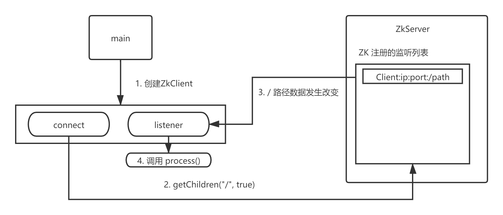

> Zookeeper 集群安装

* [zk 官网](https://zookeeper.apache.org/)地址找下载镜像 https://zookeeper.apache.org/

> 下载并解压 zk

```shell
wget https://mirrors.tuna.tsinghua.edu.cn/apache/zookeeper/zookeeper-3.6.1/apache-zookeeper-3.6.1-bin.tar.gz

tar -zxf apache-zookeeper-3.6.1-bin.tar.gz
```

> 创建data目录与编号（编号用于选举等操作, 票数一样时myid最大者为主节点）

```shell
cd apache-zookeeper-3.6.1-bin

mkdir zkData

echo '1' > zkData/myid
```

> 修改zk默认配置

```sehll
# zk 默认读取的是 conf/zoo.cfg 文件，将提供的默认配置模板作为配置文件
cp conf/zoo_sample.cfg conf/zoo.cfg

vim conf/zoo.cfg

---
#dataDir=/tmp/zookeeper
dataDir=/usr/local/zk/apache-zookeeper-3.6.1-bin/zkData

##### cluster #####
# <myid> 是创建zkData目录下的myid文件中的id
# <ip> 集群ip地址
# <port1> 集群间通讯端口
# <prot2> 集群间选举端口
server.<myid>=<ip>:<port1>:<prot2>
server.<myid>=<ip>:<port1>:<prot2>
server.<myid>=<ip>:<port1>:<prot2>
---
```

* 默认配置
  * tickTime=2000 : 心跳时间（单位：毫秒）
  * initLimit=10 : 集群启动时有10个心跳声的超时时间
  * syncLimit=5 : 集群启动后有5个心跳声的超时时间
  * clientPort=2181 : 客户端连接的端口号

> 启动zk 并查看状态

```shell
bin/zkServer.sh start

bin/zkServer.sh status
```

> zk 的选举机制

* 半数机制：集群中半数以上的机器存活集群才可用，zookeeper适合安装奇数台集群（1，3，5）
* 当集群中的选举票数达到半数以上了 (Master|Leader) 就选择出来了，其他的都为(Slave|Follwer) 
* 集群间的选举基本上都会是：( 节点数 / 2 + 1 ) 的模式

> zk 的 Shell 指令

```shell
# 显示所有操作指令
help
# 查看当前znode中包含的内容
ls /
# 查看当前znode的详细数据
ls2 /
# 创建节点
create /znode "z"
create /znode/znodesub "sub"
ls /znode
get /znode/znodesub
# -e 后当前连接关闭后节点就会被清除
create -e /tmp/znode "tmpSession"
# -s 后会在节点名后添加序号 0000000001 , 编号从当前的总节点数开始递增
create -s /tmp/znodeCount "tmpSession"

# 修改节点值
set /znode "zn"
# 获取节点的值
get /znode
# 监听节点的值，监听后会收到一次的消息
# WatchedEvent state:SyncConnected  type:NodeDataChanged path:/znode
get -w /znode
# 监听节点发生改变
# WatchedEvent state:SyncConnected type:NodeChildrenChanged path:/znode
ls -w /znode
# 删除节点
delete /tmp/znode
# 递归删除节点
rmr /tmp
# 查看节点状态
stat /znode
-- result
cZxid = 0x2#创建节点的事务 zxid
# 每次修改 ZK 状态都会收到一个zxid形式的时间戳，也就是 ZK 的事务 ID
# 事务ID是ZK中所有修改的次序。每个修改都会有唯一的zxid, 如果zxid1小于zxid2, 那么zxid1在zxid2之前发生
ctime = Wed Sep 02 15:04:44 CST 2020#znode被创建的毫秒数
mZxid = 0xd#最后一次跟新的事务zxid
mtime = Wed Sep 02 15:23:59 CST 2020#最后一次修改的毫秒数
pZxid = 0x23#最后跟新的子节点zxid
cversion = 21#子节点变化号，znode节点修改次数
dataVersion = 3#数据变化号
aclVersion = 0#访问控制列表的变化号
ephemeralOwner = 0x0#如果是临时节点值为znode的session id 如果不是临时节点值为 0
dataLength = 2#znode的数据长度
numChildren = 19#znode子节点数量
--
```

> zk写数据的过程



> java连接zk监听过程

