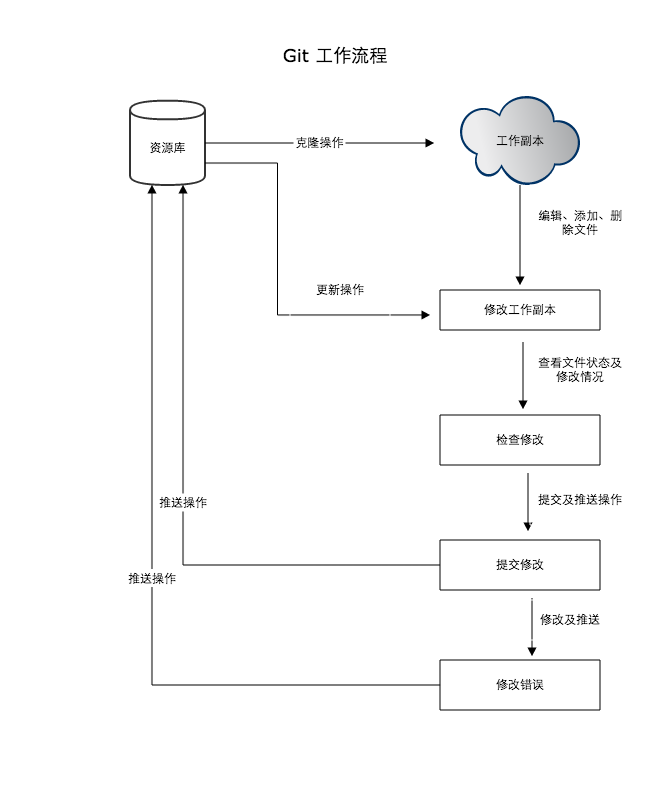
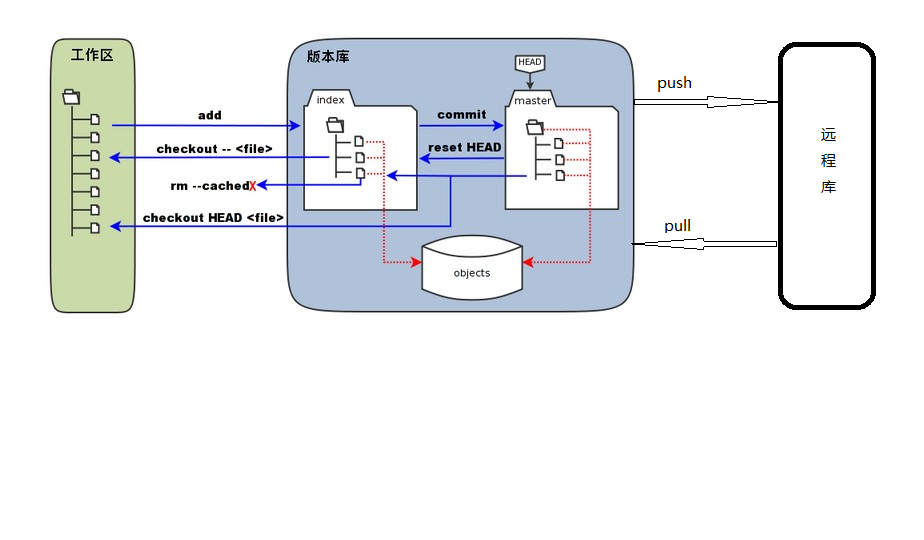

> #### git 常用命令

> Git 与 SVN 区别

1. GIT是分布式的
2. GIT把内容按元数据方式存储，而SVN是按文件;SVN把文件的元信息隐藏在一个类似.svn,.cvs等的文件夹里
3. GIT分支和SVN的分支不同：分支在SVN中一点不特别，就是版本库中的另外的一个目录
4. GIT没有一个全局的版本号，而SVN有
5. GIT的内容完整性要优于SVN





##### Git 工作区域

- **工作区：**就是你在电脑里能看到的目录
- **暂存区：**英文叫stage, 或index。一般存放在 ".git目录下" 下的index文件（.git/index）中，所以我们把暂存区有时也叫作索引（index）
- **版本库：**工作区有一个隐藏目录.git，这个不算工作区，而是Git的版本库
  - 仓库
    - 本地库：工作区中的版本库就是本地的仓库
    - 远程仓库：从远程服务端clone到本地库，通过commit提交到本地库，push推送到远程服务器仓库

> 创建一个本地仓库

```cmd
$ git init
Initialized empty Git repository in D:/git_test/.git/
```

> 克隆项目

```cmd
$ git clone http://www.znsd.com/jiangruyi/test.git
Cloning into 'test'...
warning: You appear to have cloned an empty repository.
```

> 查看工作区状态

```cmd
$ git status
```

> 提交到缓存区

```cmd
$ git add "stu.txt"	: 提交单个文件
$ git add .			: 提交所有修改过的文件
```

> 提交到本地仓库: 默认本地仓库位置:[C:\Users\Administrator\.atom]

```cmd
$ git commit -m "日志 Massage"
[master (root-commit) 5e832d6] 日志 Massage
 1 file changed, 1 insertion(+)
 create mode 100644 stu.txt
```

> 提交到远程仓库

```cmd
$ git push origin master
Username for 'http://www.znsd.com': jiangruyi@jiangruyi.com
Enumerating objects: 4, done.
Counting objects: 100% (4/4), done.
Writing objects: 100% (3/3), 251 bytes | 251.00 KiB/s, done.
Total 3 (delta 0), reused 0 (delta 0)
To http://www.znsd.com/jiangruyi/test.git
   4b2fbeb..1da8da4  master -> master
```

----

> 分支管理

> 查询所有分支

```cmd
$ git branch -v
```

> 创建分支: $ git branch `name`

```cmd
$ git branch box
```

> 切换分支: $ git checkout `name`

```cmd
$ git checkout box
```

> 合并分支：git merge `name`

```cmd
git merge branchName
```

> 删除分支：git branch -d `branchname`

```cmd
git merge branchName
```

---

> git 文件的各个状态： 

1. `unstaged` git仓库中没有此文件的相关记录 
2. `modified` git仓库中有这个文件的记录，并且此文件当前有改动 
3. `staged` 追加，删除或修改的文件被暂时保存，这些追加、删除和修改并没有提交到git仓库 
4. `commited` 追加或修改的文件被提交到本地git仓库

---

> 问题: 为啥我在子分区中创建文件主分区也会创建: `没有提交到本地库`

> 先重新设置本机git配置：`git config --global credential.helper store`

> 添加远程分支：`git remote add origin 'https://github.com/***.git'` 

---

> 文件版本回退

> 查看文件历史版本: $ git log --oneline `fileName`

```cmd
$ git log --oneline temp.txt
OR
$ git reflog
```

> 回退文件版本: $ git reset --hard HEAD~`回退几个版本` 

```cmd
$ git reset --hard HEAD~6
OR
$ git reset --hard f87dd65dd64cef5445c55180dcd038963da9f481
```

