#### 安装GitLab

```shell
sudo apt-get install curl openssh-server ca-certificates postfix
## *注意, 在安装 postfix 的时候, 选择"internet site"
## *然后, "system mail name" 服务器的IP地址/域名

curl https://packages.gitlab.com/install/repositories/gitlab/gitlab-ee/script.deb.sh | sudo bash
sudo apt-get install gitlab-ee

# 4.修改相关配置
sudo vi /etc/gitlab/gitlab.rb
​```修改内容
## GitLab URL
##! URL on which GitLab will be reachable.
##! For more details on configuring external_url see:
##! https://docs.gitlab.com/omnibus/settings/configuration.html#configuring-the-external-url-for-gitlab
# external_url 'http://ubuntu'
# 修改第一部分 http://<服务器IP>:<gitlab访问端口>
external_url 'http://192.168.6.132:11000'

### Advanced settings
# unicorn['listen'] = '127.0.0.1'
# unicorn['port'] = 8080
# 修改第二部分
unicorn['port'] = 11001

##! Advanced settings. Should be changed only if absolutely needed.
# prometheus['listen_address'] = 'localhost:9090'
# 修改第三部分
prometheus['listen_address'] = 'localhost:11002'
​```
# 重新加载GitLab配置
sudo gitlab-ctl reconfigure
# 其他选项
sudo gitlab-ctl `start`/`stop`/`restart`
```

#### 安装 Jenkins

* Jenkins 镜像下载 http://mirrors.jenkins-ci.org/
* latest 地址 [ jenkins.war](http://mirrors.jenkins-ci.org/war/latest/jenkins.war)

* 在安装好java环境时运行 jenkins.war
* `nohup java -jar jenkins.war --httpPort=12000 > jenkins.log &`
* 进入太慢可中途停止程序编辑 UpdateCenter 文件修改插件仓库地址

```xml
vim /root/.jenkins/hudson.model.UpdateCenter.xml

​```
<?xml version='1.1' encoding='UTF-8'?>
<sites>
  <site>
    <id>default</id>
    <!-- 默认配置 <url>https://updates.jenkins.io/update-center.json</url> -->
    <url>https://mirrors.tuna.tsinghua.edu.cn/jenkins/updates/update-center.json</url>
  </site>
</sites>
​```
```

* 查看默认密码： `cat /root/.jenkins/secrets/initialAdminPassword`
* 在选择初始安装的插件时选择： 
  * `Install suggested plugins` 安装建议的插件, 安装jenkins社区认为最有用的插件。
  * 推荐安装: `Job Configuration History` 配置更改历史记录插件
* 汉化 Jenkins

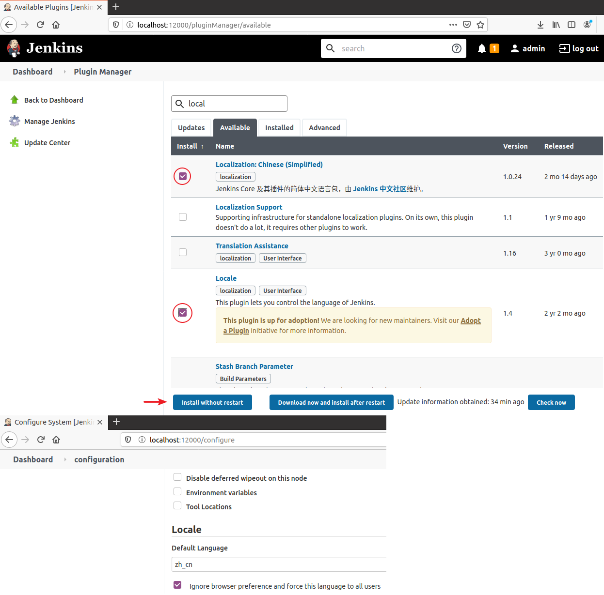

* `Manage Jenkins > Configure System` 配置 Publish over SSH , `如果配置中没有 Publish over SSH`就安装插件， 插件名 `Publish over SSH`

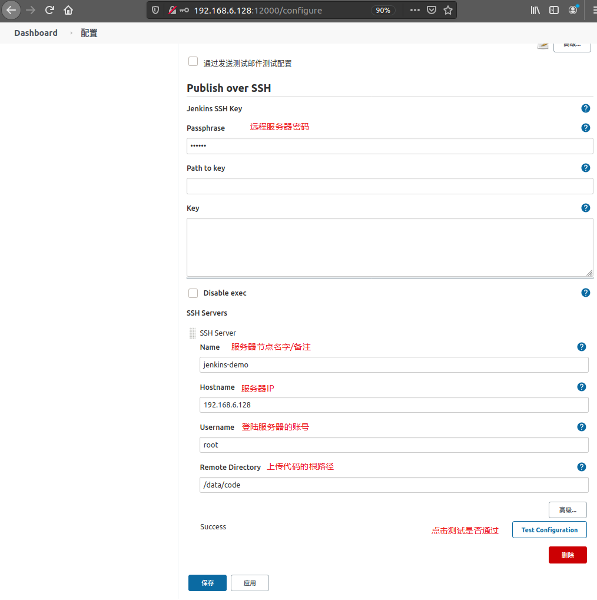

* `Manage Jenkins > Global Tool Configuration` 配置编译工具

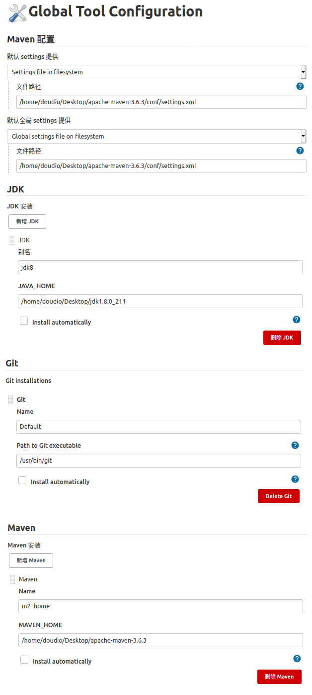

* 创建一个item选择 Freestyle project

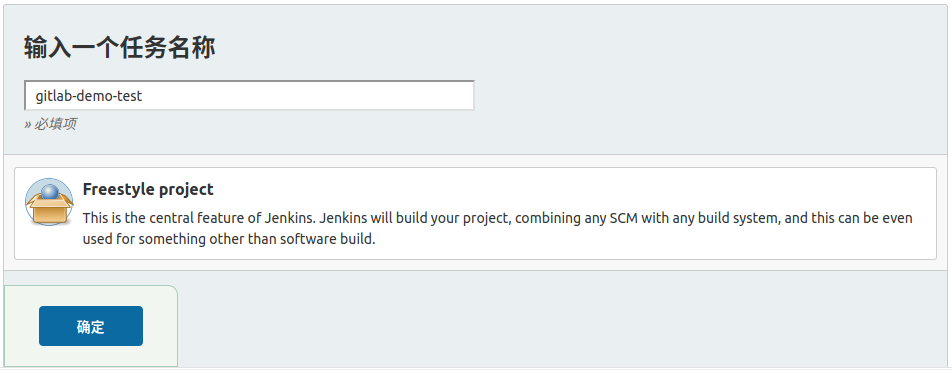

* 配置代码仓库地址


* GitLab 账号密码

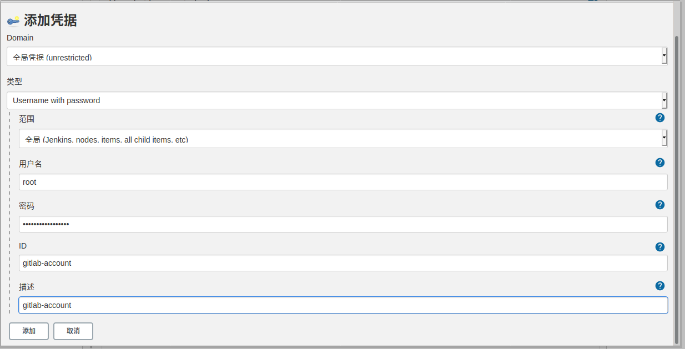

* 构建配置 (调用顶级maven目标) `-Dmaven.test.skip=true`

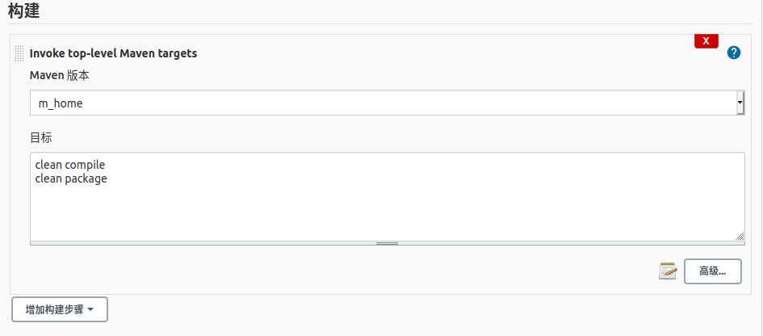

* 构建后操作

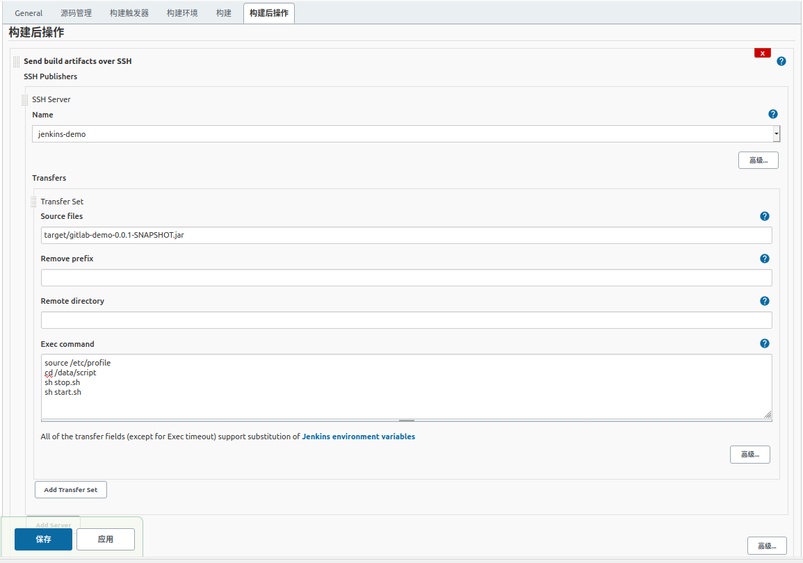

* 目录结构

```shell
data/
├── code
│   └── target
│       └── gitlab-demo-0.0.1-SNAPSHOT.jar
├── log
│   ├── api-server-0.0.1-SNAPSHOT-20210128.log
│   ├── api-server-0.0.1-SNAPSHOT-20210129.log
│   └── api-server-0.0.1-SNAPSHOT-20210131.log
└── script
    ├── start.sh
    └── stop.sh
```

* 启动/停止脚本内容

```shell
doudio@ubuntu:/data/script$ cat start.sh 
echo 'Start the program : gitlab-demo-0.0.1-SNAPSHOT.jar'
chmod 777 /data/code/target/gitlab-demo-0.0.1-SNAPSHOT.jar
echo '-------Starting-------'
current_date=`date -d "-0 day" "+%Y%m%d"`
echo $current_date
cd /data/code/target/
nohup java -jar /data/code/target/gitlab-demo-0.0.1-SNAPSHOT.jar --server.port=8081 > /data/log/gitlab-demo-0.0.1-SNAPSHOT-$current_date.log 2>&1  &
echo 'start success'
doudio@ubuntu:/data/script$ cat stop.sh 
#!/bin/bash
echo "Stop Procedure : gitlab-demo-0.0.1-SNAPSHOT.jar"
pid=`ps -ef |grep java|grep gitlab-demo-0.0.1-SNAPSHOT.jar|awk '{print $2}'`
echo 'old Procedure pid:'$pid
if [ -n "$pid" ]
then
kill -9 $pid
fi
```

* 监控重启脚本

```shell
doudio@ubuntu:/data/script$ cat jk.sh 
while true
do
   pid=`ps -ef|grep gitlab-demo-0.0.1-SNAPSHOT.jar|grep -v grep|wc -l`
   if [ $pid -eq 0 ];then
      echo 'Start the program : demo-0.0.1-SNAPSHOT.jar'
      chmod 777 /data/code/target/demo-0.0.1-SNAPSHOT.jar
      echo '-------Starting data-server-------'
      cd /data/code/target/
      timestanp=`date '+%Y-%m-%d %H:%M:%S'`
      echo "$timestanp - restart data-server-sucess"
      nohup java -jar /data/code/target/gitlab-demo-0.0.1-SNAPSHOT.jar --httpPort=8091 > /data/log/gitlab-demo-0.0.1-SNAPSHOT-$current_date.log 2>&1 &
      echo 'start succes'
      sleep 60
   else
       echo "data-server is normal"
       sleep 10
   fi
done
```

* **到此已经可以实现登陆Jenkins点击部署了, 如果需要配置只要推送代码后就自动部署再来进行如下配置**

* 修改 Jenkins 全局安全配置

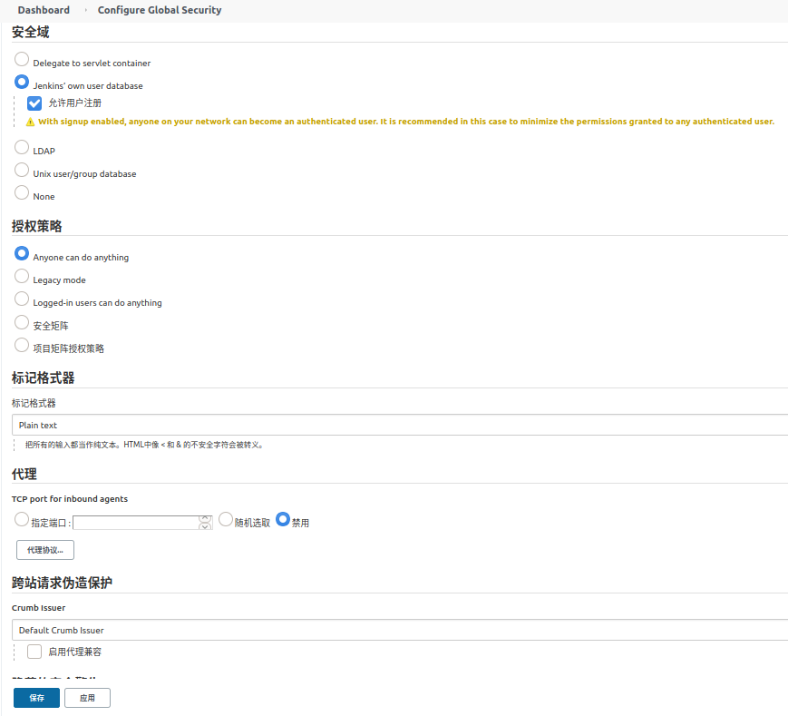

* 修改 itm 中的构建触发器, 如果触发器中没有  GitLab 就安装相关(Gitlab , Gitlab Hook) 插件

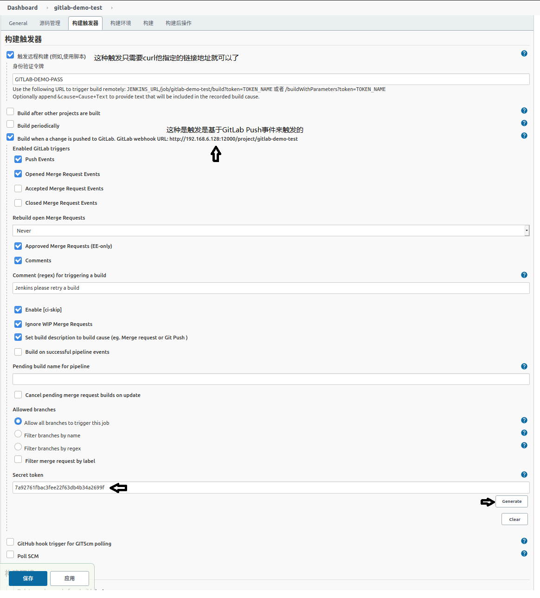

* 在GitLab中配置推送仓库后触发构建操作

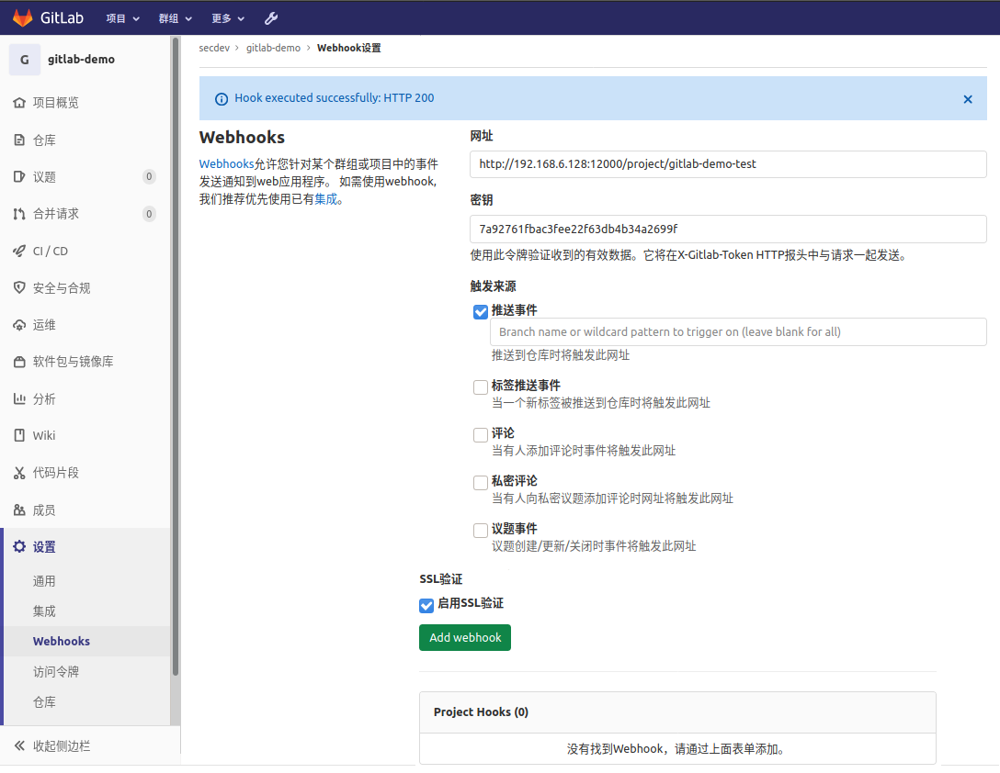

* 如果有如下报错需要修改 GitLab的  Admin area (管理中心) => Settings 配置
  * Urlis blocked: Requests to localhost are not allowed (URL被阻止：不允许对localhost的请求)

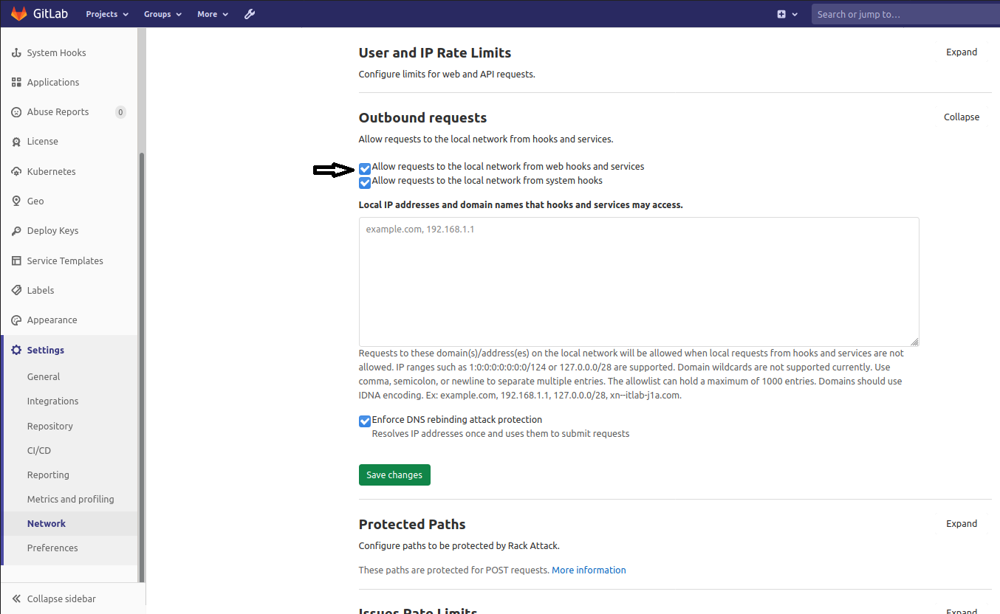

* Jenkins 编译 node vue
* https://segmentfault.com/a/1190000037540133

* Build
  * Execute shell
```shell
source /etc/profile 
cnpm cache verify 
cnpm install 
cnpm run build
zip -r dist.zip dist
```

* Post-build Actions
  * Send build artifacts over SSH
    * Source files: dist.zip
    * Remote directory: front/client/
    * Exec command: 
```shell
rm -rf /data/code/front/client/bak/*
unzip /data/code/front/client/dist.zip -d /data/code/front/client/bak/
rm -rf /usr/local/nginx/html/*
cp -fr /data/code/front/client/bak/dist/*  /usr/local/nginx/html/
```

* 整合加实践
* 安装 >> https://blog.csdn.net/ruangong1203/article/details/73065410/
* 配置SpringBoot >> https://www.cnblogs.com/wfd360/p/11314697.html
* 配置联动 >> https://www.cnblogs.com/mingerlcm/p/12702528.html
* jenkins镜像 >> https://www.cnblogs.com/yjssjm/p/12658970.html
* 企业微信通知插件(Qy Wechat Notification) >> https://blog.csdn.net/weixin_42562106/article/details/124134265
