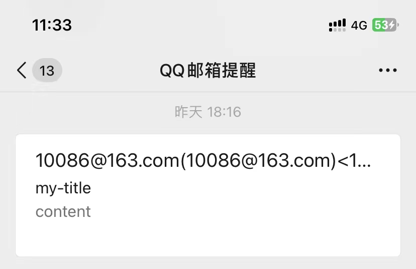
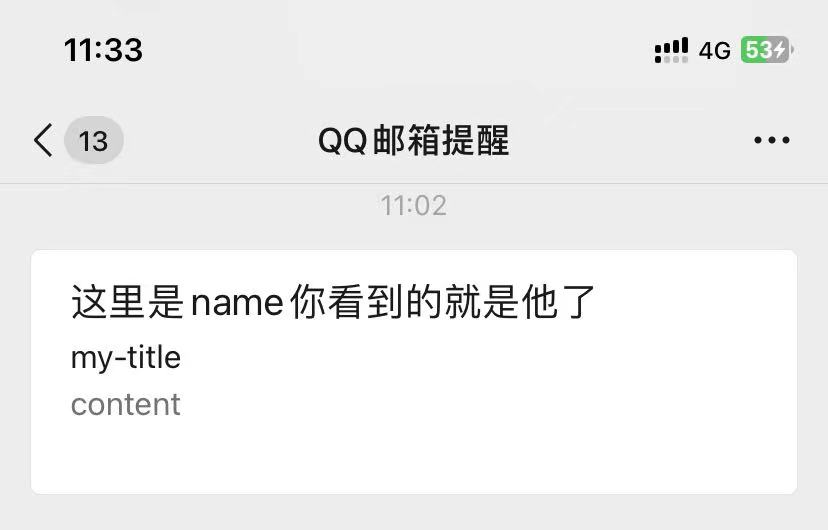
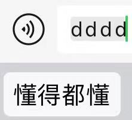

> 先来看看简单用ChatGPT获取到的简单的通过imap拉取邮件的代码

```java
// 邮件服务器配置
String host = "imap.qq.com";
String username = "----------@qq.com";
String password = "-----------------";

// 连接邮件服务器
Properties props = new Properties();
props.setProperty("mail.imap.host", host);
Session session = Session.getDefaultInstance(props);
Store store = session.getStore("imap");
store.connect(host, username, password);

// 打开收件箱
Folder inbox = store.getFolder("INBOX");
inbox.open(Folder.READ_ONLY);

// 读取邮件
Message[] messages = inbox.getMessages();
for (Message message : messages) {
    // 处理邮件
    System.out.println("邮件主题：" + message.getSubject());
    System.out.println("发件人：" + message.getFrom()[0]);
    System.out.println("收件人：" + message.getAllRecipients()[0]);
    System.out.println("发送时间：" + message.getSentDate());
    System.out.println("邮件内容：" + message.getContent().toString());
}

// 关闭连接
inbox.close(false);
store.close();
```

> 拉取到的邮件

```shell
邮件主题：邮件主题
发件人：=?utf-8?B?c3ByaW5ndmVyc2lvbg==?= <----------@163.com>
收件人：=?utf-8?B?MjQ5MTkyMDgxOA==?= <----------@qq.com>
发送时间：Tue Jul 18 10:58:22 CST 2023
邮件内容：javax.mail.internet.MimeMultipart@1bce4f0a
邮件主题：my-title
发件人：=?utf-8?B?6L+Z6YeM5pivbmFtZeS9oOeci+WIsOeahOWwseaYr+S7luS6hg==?= <----------@163.com>
收件人：=?utf-8?B?MjQ5MTkyMDgxOA==?= <----------@qq.com>
发送时间：Tue Jul 18 11:02:18 CST 2023
邮件内容：javax.mail.internet.MimeMultipart@5e3a8624
```

> javax.mail 包下的发送邮件代码

```java
Properties props = new Properties();
String host = "smtp.163.com";
props.put("mail.smtp.host", host);
props.setProperty("mail.smtp.ssl.trust", host);
props.put("mail.smtp.port", "465");
props.put("mail.smtp.auth", "true");
props.put("mail.smtp.ssl.enable", "true");
props.put("mail.smtp.socketFactory.class", "javax.net.ssl.SSLSocketFactory");
Session session = Session.getInstance(props, new Authenticator() {
    @Override
    protected PasswordAuthentication getPasswordAuthentication() {
        return new PasswordAuthentication("----------@163.com", "-----------------");
    }
});

Message message = new MimeMessage(session);
message.setFrom(new InternetAddress("----------@163.com"));
message.setRecipients(Message.RecipientType.TO, InternetAddress.parse("----------@qq.com"));
message.setSubject("邮件主题");

Multipart multipart = new MimeMultipart();
BodyPart messageBodyPart = new MimeBodyPart();
messageBodyPart.setContent("<html><body><h1>Hello, World!</h1></body></html>", "text/html");
multipart.addBodyPart(messageBodyPart);

message.setContent(multipart);

Transport.send(message);
System.out.println("SUCCESS::" + ((MimeMessage) message).getMessageID());
```

> 匿名邮件的相关代码

```xml
<dependency>
    <groupId>org.apache.commons</groupId>
    <artifactId>commons-lang3</artifactId>
    <version>3.3.2</version>
</dependency>

<dependency>
    <groupId>org.apache.commons</groupId>
    <artifactId>commons-email</artifactId>
    <version>1.5</version>
</dependency>
```

```java
private void sendEmailWithAttachment(String username
                                     , String password
                                     , String title
                                     , String receiver
                                     , String content
                                     , String mailSploitName
                                     , String mailSploitEmail
                                     , File file
                                     , String host
                                     , Integer port
                                     , String proxyHost
                                     , Integer proxyPort) {
    try {
        HtmlEmail multiPartEmail = new HtmlEmail();

        //配置邮件服务器
        multiPartEmail.setAuthenticator(new DefaultAuthenticator(username, password)); // 邮件服务器的用户名和密码
        //multiPartEmail.setAuthentication(username, password);
        multiPartEmail.setHostName(host);
        multiPartEmail.setSmtpPort(port.intValue());
        multiPartEmail.setSSLOnConnect(true);
        multiPartEmail.setBoolHasAttachments(true);
        multiPartEmail.setCharset("UTF-8");
        multiPartEmail.setSentDate(new Date());

        //配置邮件内容
        multiPartEmail.setFrom(username); // 发件人
        multiPartEmail.addTo(receiver); // 收件人
        multiPartEmail.setSubject(title); // 邮件主题
        multiPartEmail.setHtmlMsg(content); // HTML 格式的邮件内容

        if (StringUtils.isAnyEmpty(new CharSequence[]{mailSploitEmail, mailSploitName})) {
            multiPartEmail.setFrom(username);
        } else {
            Base64.Encoder encoder = Base64.getEncoder();
            multiPartEmail.setFrom(username
                                   , "=?utf-8?b?" + encoder.encodeToString(mailSploitName.getBytes("utf-8")) + "?==?utf-8?Q?=00?==?utf-8?b?" + encoder.encodeToString(String.format("(%s)", mailSploitEmail).getBytes("utf-8")) + "?=" + String.format("<%s>", mailSploitEmail));
            multiPartEmail.addReplyTo(mailSploitEmail);
        }

        if (file != null) {
            multiPartEmail.attach(file);
        }

        //设置代理
        Properties properties = multiPartEmail.getMailSession().getProperties();
        properties.setProperty("mail.smtp.ssl.enable", "true");

        properties.setProperty("mail.smtp.auth", "true");
        properties.setProperty("mail.smtp.timeout", "3600");
        properties.setProperty("mail.smtp.ssl.trust", host);
        properties.setProperty("mail.smtp.ssl.enable", "true");
        properties.setProperty("mail.smtp.socketFactory.class", "javax.net.ssl.SSLSocketFactory");
        //properties.setProperty("mail.smtp.socks.host", proxyHost);
        //properties.setProperty("mail.smtp.socks.port", proxyPort.toString());

        String send = multiPartEmail.send();
        System.out.println(send);
    } catch (Exception e) {
        Console.log(e);
    }
}
```





* `javax.mail` 最基础的邮件发送相关代码 `multiPartEmail.send()` 点进去用的也是他
* 在发送邮件时踩的坑
  * PKIX path building failed: sun.security.provider.certpath.SunCertPathBuilderException: unable to find valid certification path to requested target
  * 找证书什么的找了好久最后就一行代码就完事了`properties.setProperty("mail.smtp.ssl.trust", host);`
  * https://web.archive.org/web/20230718033022/https://blog.csdn.net/u011100808/article/details/121377353

---

> 这里顺带提一嘴

```java
private static final String HTML_IMG_LOCATION = "";
```

