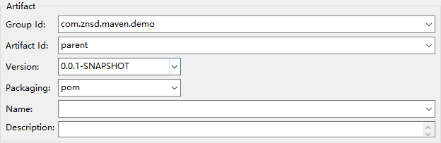
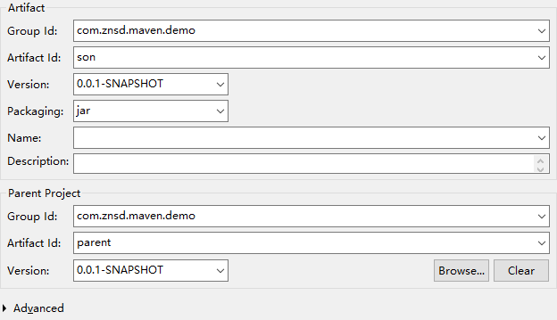
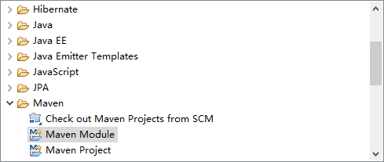

> ### Maven常用命令

| 命令             | 描述                                                       |
| ---------------- | ---------------------------------------------------------- |
| mvn compile      | 编译当前 maven 项目                                        |
| mvn test-compile | 编译测试类                                                 |
| mvn clean        | 清理缓存                                                   |
| mvn test         | 执行测试                                                   |
| mvn package      | 项目打包                                                   |
| mvn install      | 把包安装到maven本地 ,  可以被其他工程作为依赖来使用。 |

> 在执行 mvn package 时会

1. 将所有的测试类执行一编
2. 生成测试报告
   1. maven-archiver : 档案[ 基本信息比如: 版本号, 包名 ]
   2. surefire-reports : 测试报告
   3. project-xxx.jar : 打包后的.jar

> `继承`和`聚合`

1. 继承指的是某个项目继承一个父项目, 可以在父项目拿到`jar`

> #### `maven` - `继承`

> 创建一个父工程，`package`设置为`pom`

> 创建子工程, 指定父工程

> #### `maven` - `聚合`

> 创建`pom`工程

> 更具这个`pom`工厂创建`module`工厂

> 使用到几个命令

1. `package`
2. `install`
3. `compile`

---

#### Default生命周期

**Default生命周期是Maven生命周期中最重要的一个，绝大部分工作都发生在这个生命周期中，这里只解释一些常用的阶段：**

- validate：验证工程是否正确，所有需要的资源是否可用。
- compile：编译项目的源代码。
- test：使用合适的单元测试框架来测试已编译的源代码。这些测试不需要已打包和布署。
- package：把已编译的代码打包成可发布的格式，比如jar。
- integration-test：如有需要，将包处理和发布到一个能够进行集成测试的环境。
- verify：运行所有检查，验证包是否有效且达到质量标准。
- install：把包安装到maven本地仓库，可以被其他工程作为依赖来使用。
- Deploy：在集成或者发布环境下执行，将最终版本的包拷贝到远程的repository，使得其他的开发者或者工程可以共享。