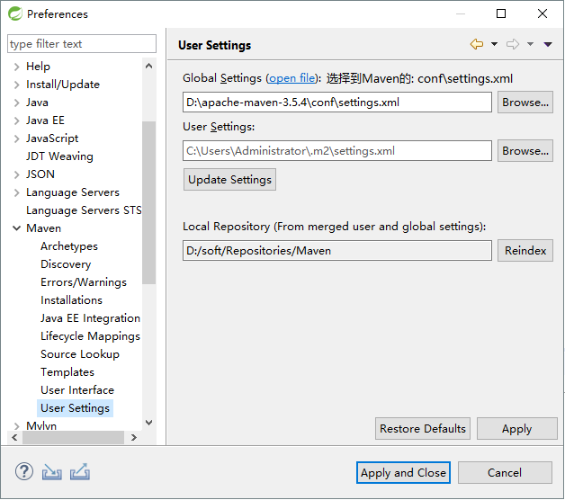

> ### Maven 仓库配置

1. `bin` : 可运行命令
2. `boot` : maven 的加载器
3. `conf` : 配置信息
4. `lib` : 类库

> ### 修改默认 `Maven` 配置

> 打开: apache-maven-3.5.4\conf\settings.xml

1. 配置本地 `JAR` 存放位置

```xml
<!-- localRepository
   | The path to the local repository maven will use to store artifacts.
   |
   | Default: ${user.home}/.m2/repository
  <localRepository>/path/to/local/repo</localRepository>
  -->
<localRepository>D:/soft/Repositories/Maven</localRepository>
```

> Default: ${user.home}/.m2/repository : 默认`maven`是放在C盘当前登录的用户下/.m2/repositories

---

> ### 修改中央仓库地址

```xml
<mirrors>
    <!-- mirror
     | Specifies a repository mirror site to use instead of a given repository. The repository that
     | this mirror serves has an ID that matches the mirrorOf element of this mirror. IDs are used
     | for inheritance and direct lookup purposes, and must be unique across the set of mirrors.
     |
    <mirror>
      <id>mirrorId</id>
      <mirrorOf>repositoryId</mirrorOf>
      <name>Human Readable Name for this Mirror.</name>
      <url>http://my.repository.com/repo/path</url>
    </mirror>
     -->
    <mirror>
        <id>MyNexus</id>
        <mirrorOf>central</mirrorOf>
        <name>internal nexus repository</name>
        <url>http://192.168.3.210:8081/nexus/content/groups/public/</url>
    </mirror>
</mirrors>
```

> 默认是国外服务器下载 `Jar` 建议修改到国内的一个镜像下 一般配置`aliyun`中央仓库
>
> 配置私服(建议放在第一个)

```xml
<!-- 学校:私服配置 -->
<mirror>
	<id>MyNexus</id>
	<mirrorOf>central</mirrorOf>
	<name>internal nexus repository</name>
	<url>http://192.168.3.210:8081/nexus/content/groups/public/</url>
</mirror>

<!-- 阿里云中央仓库 -->
<mirror>
	<id>alimaven</id>
	<name>aliyun maven</name>
	<!--
		新版地址
		<url>http://maven.aliyun.com/nexus/content/groups/public/</url>
	-->
	<!-- 旧版地址 -->
	<url>https://maven.aliyun.com/repository/public</url>
	<mirrorOf>central</mirrorOf>        
</mirror>
```

> ### 配置Mavan环境变量

1. 定义环境变量: M2_HOME=D:\apache-maven-3.5.4`Mavan` 安装路径

2. 在 `path` 中添加环境变量: %M2_HOME%\bin

> 检查环境变量是否配置好进入dos 操作系统下，输入`mvn -version`

---

> ### Eclipse 集成 Mavan

