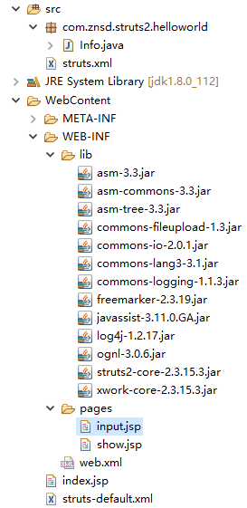

> ## Struts2 Hello World!

1. 导入 Struts2 常用 jar 包
2. 在 web.xml 中配置 Struts2
3. 在 src 下编写 Struts2 配置
4. 通过浏览器访问


> ### 导入 Struts2 常用 jar

**jar包位置: struts\apps\struts2-blank\WEB-INF\lib**

- asm-3.3.jar
- asm-commons-3.3.jar
- asm-tree-3.3.jar
- commons-fileupload-1.3.jar
- commons-io-2.0.1.jar
- commons-lang3-3.1.jar
- commons-logging-1.1.3.jar
- freemarker-2.3.19.jar
- javassist-3.11.0.GA.jar
- log4j-1.2.17.jar
- ognl-3.0.6.jar
- struts2-core-2.3.15.3.jar
- xwork-core-2.3.15.3.jar


> ### 在 web.xml 中配置 Struts2

~~~xml
<?xml version="1.0" encoding="UTF-8"?>
<web-app xmlns:xsi="http://www.w3.org/2001/XMLSchema-instance"
	xmlns="http://xmlns.jcp.org/xml/ns/javaee"
	xsi:schemaLocation="http://xmlns.jcp.org/xml/ns/javaee http://xmlns.jcp.org/xml/ns/javaee/web-app_3_1.xsd"
	version="3.1">
	
	<!-- 配置 Struts2 的 Filter -->
	<filter>
        <filter-name>struts2</filter-name>
        <filter-class>org.apache.struts2.dispatcher.ng.filter.StrutsPrepareAndExecuteFilter</filter-class>
    </filter>

    <filter-mapping>
        <filter-name>struts2</filter-name>
        <url-pattern>/*</url-pattern>
    </filter-mapping>
	
</web-app>
~~~


> ### 在 src 下编写 Struts2 配置

~~~xml
<?xml version="1.0" encoding="UTF-8" ?>
<!DOCTYPE struts PUBLIC
	"-//Apache Software Foundation//DTD Struts Configuration 2.3//EN"
	"http://struts.apache.org/dtds/struts-2.3.dtd">

<struts>
	<package name="HelloWorld" extends="struts-default">
        
		<action name="product-show" class="com.znsd.struts2.helloworld.Info" method="show">
			<result name="show" type="redirect">/WEB-INF/pages/show.jsp</result>
		</action>
        
	</package>
</struts>
~~~

---

~~~java
public class Info {
    
	private String name;
	private String sex;
	private Integer age;

    Get(), Set();
    
	@Override toString();
	
	public String show () {
		System.out.println(this);
		return "show";
	}
	
}
~~~


>  ### 在页面中: 通过浏览器访问

---

### input.jsp

```html
<form action="product-show.action" method="post">
	<label>
		姓名: <input type="text" name="name" />
	</label>
	<br /><br />
	<label>
		性别: <input type="text" name="sex" />
	</label>
	<br /><br />
	<label>
		年龄: <input type="text" name="age" />
	</label>
	<br /><br />
	<input type="submit" />
</form>
```

### show.jsp

~~~html
<form action="product-show.action" method="post">
	<label>
		姓名: <input type="text" name="name" />
	</label>
	<br /><br />
	<label>
		性别: <input type="text" name="sex" />
	</label>
	<br /><br />
	<label>
		年龄: <input type="text" name="age" />
	</label>
	<br /><br />
	<input type="submit" />
</form>
~~~

> ### eclipse下的包结构




> ### 简单 - 配置说明

---

```xml
<!-- 
	package	: 包. struts2 使用 package 来组织模块.
	name	: 必须, 用户其他的包应用当前包
	extends	: 当前包基础那个包, 继承的, 即可继承其中的所有配置. 通常情况下继承: struts-default
	namespace	: 可选, 如果他没有给出, 则 [ / ] 为默认值
				若 namespace有一个非默认值, 则要想调用这个包里的 Action,
				就必须把这个属性所定义的命名空间添加到有关的 URL字符串里
				http://localhost:8080/contextPath/namespace/actionName.action
 -->
<!-- namespace="/package" -->
<package name="HelloWorld" extends="struts-default">
	<!-- 配置一个 action: 一个 struts2 的请求就是一个 action
		name	: 对应 struts2 的请求名字(或对一个 servletPath, 但去除 / 和扩展名), 不包括扩展名
		result	: 结果
	 -->
	<action name="product-input">
		<result>/WEB-INF/pages/input.jsp</result>
	</action>
	
	<!-- 
		class 默认值为: com.opensymphony.xwork2.ActionSupport
		method 默认值为: execute
		result: 结果
	 -->
	<action name="product-show" class="com.znsd.struts2.helloworld.Info" method="show">
<!-- 
	result: 结果, 表示action方法执行后可能返回一个结果, 所以一个 action 节点可能会有多个 result子节点多个 result 子节点使用 name 来区分

	name: 标识一个 result, 和 action 方法(method)的返回值对应. 默认值为 success
	type: 标识结果的类型, 默认值为 dispatcher(转发到结果)
		dispatcher	: 转发
		redirect	: 重定向, 重定向到不了 WEB-INF 目录下
-->
		<result name="show" type="redirect">/WEB-INF/pages/show.jsp</result>
	</action>
</package>
```

