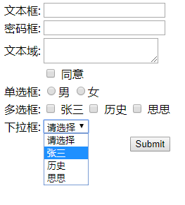

> ## OGNL and s - taglib

​	在jsp页面上可以使用 OGNL ( Object-Graph Navigation Language : 对象-图导航语言 ) 访问到值栈 ( ValueStack ) 里的对象属性

​	若希望访问值栈中 ContextMap 中的数据, 需要给 OGNL 表达式加上一个前缀[ # ] 如果没有前缀 #, 搜索将在 ObjectStack 里进行

---

1. 关于值栈:

   1). helloWorld 时, ${productName} 读取 productName 值, 实际上该属性并不在 request 等域对象中, 而是从值栈中获取的. 

   2). ValueStack: 

2. 可以从 ActionContext 中获取值栈对象

3. 值栈分为两个逻辑部分

	> Map 栈: 实际上是 OgnlContext 类型, 是个 Map, 也是对 ActionContext 的一个引用. 里边保存着各种 Map: requestMap, sessionMap, applicationMap, parametersMap, attr
	
	> 对象栈: 实际上是 CompoundRoot 类型, 是一个使用 ArrayList 定义的栈. 里边保存各种和当前 Action 实例相关的对象. 是一个数据结构意义的栈.

  2. Struts2 利用 s:property 标签和 OGNL 表达式来读取值栈中的属性值

 1). 值栈中的属性值:

 	> 对于对象栈: 对象栈中某一个对象的属性值

 	> Map 栈: request, session, application 的一个属性值 或 一个请求参数的值. 

 2). 读取对象栈中对象的属性:

 	> 若想访问 Object Stack 里的某个对象的属性. 可以使用以下几种形式之一: 

	object.propertyName ; object['propertyName'] ; object["propertyName"]	
	
	> ObjectStack 里的对象可以通过一个从零开始的下标来引用. ObjectStack 里的栈顶对象可以用 [0] 来引用,它下面的那个对象可以用 [1] 引用. 
	   
	  [0].message   
	     
	> [n] 的含义是从第 n 个开始搜索, 而不是只搜索第 n 个对象
	
	> 若从栈顶对象开始搜索, 则可以省略下标部分: message 
	
	> 结合 s:property 标签: <s:property value="[0].message" />  <s:property value="message" />

 3). 默认情况下, Action 对象会被 Struts2 自动的放到值栈的栈顶. 

---

可以利用 OGNL 调用

​	任何一个 Java 类里的静态字段或方法.

​	被压入到 ValueStack 栈的对象上的公共字段和方法. 

默认情况下, Struts2 不允许调用任意 Java 类静态方法,  需要重新设置 struts.ognl.allowStaticMethodAccess 标记变量的值为 true. 

调用静态字段或方法需要使用如下所示的语法: 

 1. @fullyQualifiedClassName@fieldName

 2. @java.util.Calendar@DECEMBER@fullyQualifiedClassName@methodName(argumentList)

 3. @app4.Util@now()

    调用一个实例字段或方法的语法, 其中 object 是 Object Stack 栈里的某个对象的引用: 

    1. object.fieldName: [0].datePattern.
    2. object.methodName(argumentList): [0].repeat(3, “Hello”);

> ### 访问数组类型的属性

​	有些属性将返回一个对象数组而不是单个对象, 可以像读取任何其他对象属性那样读取它们. 这种数组型属性的各个元素以逗号分隔, 并且不带方括号

​	可以使用下标访问数组中指定的元素: colors[0]

​	可以通过调用其 length 字段查出给定数组中有多少个元素: colors.length

> ### 访问list类型的属性

​	有些属性将返回的类型是 java.util.List, 可以像读取任何其他属性那样读取它们. 这种 List 的各个元素是字符串, 以逗号分隔, 并且带方括号

​	可以使用下标访问 List 中指定的元素: colors[0]

​	可以通过调用其 size 方法或专用关键字 size 的方法查出给定List 的长度: colors.size 或 colors.size()

​	可以通过使用 isEmpty() 方法或专用关键字 isEmpty 来得知给定的 List 是不是空. colors.isEmpty 或 colors.isEmpty()

​	还可以使用 OGNL 表达式来创建 List, 创建一个 List 与声明一个 Java 数组是相同的: {“Red”, “Black”, “Green”}


```html
<!-- 使用 Struts2 标签, 导入 Struts2 标签库 -->
<%@ taglib prefix="s" uri="/struts-tags" %>
```

> ## property

​	Struts 的 property 标签用来输出值栈中的一个属性

|  名字   |  类型   |    默认值    |                         说明                          |
| :-----: | :-----: | :----------: | :---------------------------------------------------: |
| default | String  |              | 可选, 如果 value 值为 NULL 或没有给定, 将显示该属性值 |
| escape  | boolean |     true     |         可选, 是否要对 HTML 特殊字符进行转义          |
|  value  | String  | 来自栈顶对象 |                     将要显示的值                      |

```html
使用方式: <s:property value="student.name" />
```

> ### debug

```html
<!-- 注意在 struts2 高版本中 要开启开发者模式 -->
<s:debug></s:debug>
```

```html
开启开发者模式: <constant name="struts.devMode" value="true"></constant>
```

> ### iterator

|  属性  |       描述       |
| :----: | :--------------: |
| value  |   要迭代的数据   |
| status |      源数据      |
| begin  |    从哪里开始    |
|  end   |    到哪里结束    |
|  step  |   每次增加多少   |
|  var   | 定义一个变量接收 |

| status 的 属性 |  类型   |                       描述                       |
| :------------: | :-----: | :----------------------------------------------: |
|     index      | integer |                    数据的下标                    |
|     count      | integer |               数据在集合中是第几个               |
|     first      | boolean |                   是否是第一个                   |
|      last      | boolean |                  是否是最后一个                  |
|      even      | boolean |                    是否是偶数                    |
|      odd       | boolean |                    是否是奇数                    |
|    modulus     | integer | 传入一个值返回的是 ( count / 传入的参数 ) 的余数 |

```html
<s:iterator value="data" status="i">
   	${i.index } - ${i.count }
    ${i.first } - ${i.last }
    ${i.even } - ${i.odd }
    ${name } - ${gender }
</s:iterator>
```

---

> ### sort 排序标签

|    属性    | 描述                         |
| :--------: | ---------------------------- |
| comparator | 定义的比较器                 |
|   source   | 比较的是那个集合             |
|  newList   | 放在一个新集合, 定义一个名字 |

```jsp
<%
   /** 定义比较器, 放入 requset 中 */
   Comparator comparator = new Comparator();
   request.setAttribute("comparator", comparator);
%>
<s:sort comparator="#request.comparator" source="srcList" var="newList"></s:sort>
<s:iterator value="#attr.newList">
    ${attr }
</s:iterator>
```

> ### if elseif else 条件判断

```html
<!-- 支持java中的 if elseif else -->
<s:if test="true"> run if </s:if>
<s:elseif test="true"> run elseif </s:elseif>
<s:else> run else </s:else>
```

```java
/** 效果模仿上 */
if (true) {
    System.out.println(" run if ");
} else if (true) {
	System.out.println(" elseif ");
} else {
    System.out.println(" run else ");
}
```

> ### date 格式化日期

```html
<s:date name="" format="" nice="" timezone="" var=""/>
```

| 属性   | 类型   | 描述                             |
| :----: | :----: | :------------------------------- |
| name   | String | 被格式化的日期                   |
| format | String | 日期的格式: `yyyy-MM-dd HH:mm:ss` |
| nice | boolean | 是否输出指定日期与当前日期的差 |
| var | String | 用来引用被压入 ValueStack 栈的日期变量 |
| timezone | String | 指定差几个时区 |

> ### push 将一个对象压入值栈

```php+HTML
<s:push value="Object"></s:push>
```

---

> ### 表单标签

```html
<%@ taglib prefix="s" uri="/struts-tags" %>
<s:form action="#">
    <s:textfield name="text" label="文本框"></s:textfield>
    <s:password name="password" label="密码框"></s:password>
    <s:textarea name="textarea" label="文本域"></s:textarea>
    <s:checkbox name="isMark" label="同意"></s:checkbox>
    <s:radio name="gender" list="#{'1':'男','0':'女'}" label="单选框"></s:radio>
    <s:checkboxlist name="students" 
                    list="#request.students" 
                    listKey="id" 
                    listValue="name" 
                    label="多选框"></s:checkboxlist>
    <s:select list="#request.students" 
              listKey="id" 
              listValue="name" 
              headerKey="" 
              headerValue="请选择" 
              label="下拉框"></s:select>
    <s:submit></s:submit>
</s:form>
```




> ## 声明式异常处理		

	<package name="struts-test-ognl" extends="struts-default">
		<!-- 配置全局 result -->
		<global-results>
			<result name="input-student">/input-student.jsp</result>
		</global-results>	
		<!-- 配置全局异常处理 -->
		<global-exception-mappings>
			<!-- result: 如果出异常了去哪里个 全局 result, exception: 捕获哪个异常 -->
			<exception-mapping result="input-student" exception="java.lang.RuntimeException" />
		</global-exception-mappings>
	
		<action name="student" class="com.znsd.struts2.action.StudentAction" method="save">
	        <!-- 配置局部异常捕获 -->
	        <!-- result: 如果出异常了去哪里个页面, exception: 捕获哪个异常 -->
	        <exception-mapping result="success" exception="Exception"></exception-mapping>
	        <result>/input-show.jsp</result>
		</action>
	
	</package>
