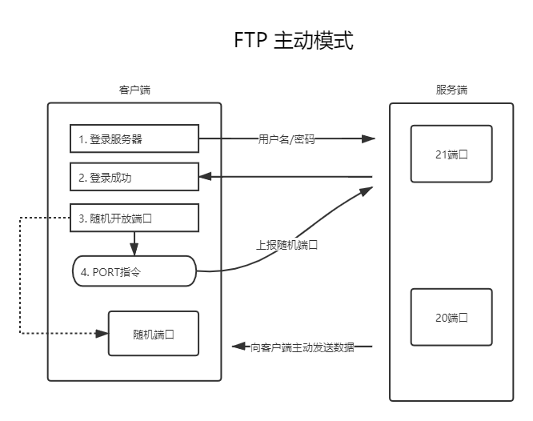
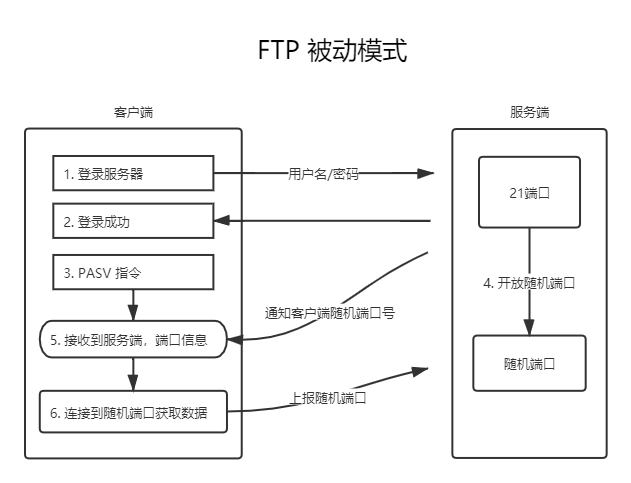

> ### vsftpd install

* 主动模式（PORT）
  * 主动模式是从服务器端向客户端发起连接
  * 需要在目标机器与服务器能直接访问时设置
* 和被动模式（PASV）
  * 被动模式是客户端向服务器端发起连接
  * 适用于云服务器的模式
* 两者的共同点是都使用21端口进行用户验证及管理
* 差别在于传送数据的方式不同，PORT模式的FTP服务器数据端口固定在20，而PASV模式则在1025-65535之间随机

```shell
# 安装
$ yum install vsftpd -y
# 去到根目录找配置文件
$ cd /etc/vsftpd
# 编辑 vsftpd 配置
$ vim vsftpd.conf
```

> vsftpd.conf

```properties
# Example config file /etc/vsftpd/vsftpd.conf
#
# The default compiled in settings are fairly paranoid. This sample file
# loosens things up a bit, to make the ftp daemon more usable.
# Please see vsftpd.conf.5 for all compiled in defaults.
#
# READ THIS: This example file is NOT an exhaustive list of vsftpd options.
# Please read the vsftpd.conf.5 manual page to get a full idea of vsftpd's
# capabilities.
#
# Allow anonymous FTP? (Beware - allowed by default if you comment this out).
# 是否允许匿名用户登陆ftp,如否则选择NO
anonymous_enable=NO
#
# Uncomment this to allow local users to log in.
# When SELinux is enforcing check for SE bool ftp_home_dir
# 是否允许本地用户登录
local_enable=YES
# Uncomment this to enable any form of FTP write command.
# 是否允许登陆用户有写权限。属于全局设置，默认值为YES
write_enable=YES
#
# Default umask for local users is 077. You may wish to change this to 022,
# if your users expect that (022 is used by most other ftpd's)
local_umask=022
#
# Uncomment this to allow the anonymous FTP user to upload files. This only
# has an effect if the above global write enable is activated. Also, you will
# obviously need to create a directory writable by the FTP user.
# When SELinux is enforcing check for SE bool allow_ftpd_anon_write, allow_ftpd_full_access
#anon_upload_enable=YES
#
# Uncomment this if you want the anonymous FTP user to be able to create
# new directories.
#anon_mkdir_write_enable=YES
#
# Activate directory messages - messages given to remote users when they
# go into a certain directory.
# 是否显示目录说明文件, 默认是YES但需要创建.message文件
dirmessage_enable=YES
#
# Activate logging of uploads/downloads.
# 是否记录ftp传输过程
xferlog_enable=YES
#
# Make sure PORT transfer connections originate from port 20 (ftp-data).
# 指定FTP使用20端口进行数据传输, 默认值为YES
connect_from_port_20=NO
#
# If you want, you can arrange for uploaded anonymous files to be owned by
# a different user. Note! Using "root" for uploaded files is not
# recommended!
#chown_uploads=YES
#chown_username=whoever
#
# You may override where the log file goes if you like. The default is shown
# below.
# 指定ftp日志文件
xferlog_file=/var/log/xferlog
#
# If you want, you can have your log file in standard ftpd xferlog format.
# Note that the default log file location is /var/log/xferlog in this case.
# 指定日志使用xferlog标准格式, 默认值为关闭
xferlog_std_format=YES
#
# You may change the default value for timing out an idle session.
#idle_session_timeout=600
#
# You may change the default value for timing out a data connection.
#data_connection_timeout=120
#
# It is recommended that you define on your system a unique user which the
# ftp server can use as a totally isolated and unprivileged user.
#nopriv_user=ftpsecure
#
# Enable this and the server will recognise asynchronous ABOR requests. Not
# recommended for security (the code is non-trivial). Not enabling it,
# however, may confuse older FTP clients.
#async_abor_enable=YES
#
# By default the server will pretend to allow ASCII mode but in fact ignore
# the request. Turn on the below options to have the server actually do ASCII
# mangling on files when in ASCII mode. The vsftpd.conf(5) man page explains
# the behaviour when these options are disabled.
# Beware that on some FTP servers, ASCII support allows a denial of service
# attack (DoS) via the command "SIZE /big/file" in ASCII mode. vsftpd
# predicted this attack and has always been safe, reporting the size of the
# raw file.
# ASCII mangling is a horrible feature of the protocol.
#ascii_upload_enable=YES
#ascii_download_enable=YES
#
# You may fully customise the login banner string:
#ftpd_banner=Welcome to blah FTP service.
#
# You may specify a file of disallowed anonymous e-mail addresses. Apparently
# useful for combatting certain DoS attacks.
#deny_email_enable=YES
# (default follows)
#banned_email_file=/etc/vsftpd/banned_emails
#
# You may specify an explicit list of local users to chroot() to their home
# directory. If chroot_local_user is YES, then this list becomes a list of
# users to NOT chroot().
# (Warning! chroot'ing can be very dangerous. If using chroot, make sure that
# the user does not have write access to the top level directory within the
# chroot)
# 用于指定用户列表文件中的用户是否允许切换到上级目录。默认值为NO
chroot_local_user=YES
# 设置是否启用chroot_list_file配置项指定的用户列表文件, 默认值为NO
chroot_list_enable=YES
# (default follows)
# 指定 chroot_list_enable 的用户列表路径文件不能为空
# 在 chroot_list 文件中的用户可以访问ftp上的任意目录
chroot_list_file=/etc/vsftpd/chroot_list
#
# You may activate the "-R" option to the builtin ls. This is disabled by
# default to avoid remote users being able to cause excessive I/O on large
# sites. However, some broken FTP clients such as "ncftp" and "mirror" assume
# the presence of the "-R" option, so there is a strong case for enabling it.
#ls_recurse_enable=YES
#
# When "listen" directive is enabled, vsftpd runs in standalone mode and
# listens on IPv4 sockets. This directive cannot be used in conjunction
# with the listen_ipv6 directive.
# 修改ftp默认端口
listen=YES
listen_port=10021
#
# This directive enables listening on IPv6 sockets. By default, listening
# on the IPv6 "any" address (::) will accept connections from both IPv6
# and IPv4 clients. It is not necessary to listen on *both* IPv4 and IPv6
# sockets. If you want that (perhaps because you want to listen on specific
# addresses) then you must run two copies of vsftpd with two configuration
# files.
# Make sure, that one of the listen options is commented !!
#listen_ipv6=YES

# 禁止匿名用户
pam_service_name=vsftpd
userlist_enable=YES
tcp_wrappers=YES

#开启主动模式
pasv_enable=YES
pasv_min_port=4500
pasv_max_port=4600
pasv_address=<ip>
pasv_addr_resolve=YES

allow_writeable_chroot=YES
```

> linux 下重启的几个指令

```shell
# 启动 vsftpd 
$ systemctl start vsftpd
# 重启 vsftpd 
$ systemctl restart vsftpd
# 开机自启 vsftpd
$ systemctl enable vsftpd
```

> ftp 添加用户

```shell
# 添加用户给用户绑定到某个目录
useradd <username> -d <local-dir>
# 给用户设置登陆密码
passwd <username>
# 禁止用户通过ssh连接到linux
vim /etc/passwd
---
<username>:x:1001:1001::<local-dir>:/sbin/nologin
---
# 设置文件的用户组与用户
chown -R <username>:<username> <local-dir>
# 设置目录默认权限(可读可写)
chmod 760 <local-dir>
```

> ftp 主动模式/被动模式 图解





> FTPUtils

* maven

```xml
<dependency>
    <groupId>commons-net</groupId>
    <artifactId>commons-net</artifactId>
    <version>3.8.0</version>
</dependency>
```

```java
import org.apache.commons.net.ftp.FTP;
import org.apache.commons.net.ftp.FTPClient;
import org.apache.commons.net.ftp.FTPFile;

import java.io.*;

public class FTPUtil implements AutoCloseable {

    private FTPClient ftpClient;

    public FTPUtil(String serverIP, int port, String userName, String password) throws IOException {
        this(serverIP, port, userName, password, false);
    }

    /**
     * @param serverIP ftpServer ip
     * @param port     ftpPort default 21
     * @param userName
     * @param password
     * @param pattern  true 主动模式, false 被动模式
     */
    public FTPUtil(String serverIP, int port, String userName, String password, boolean pattern) throws IOException {
        ftpClient = new FTPClient();
        ftpClient.connect(serverIP, port);
        ftpClient.login(userName, password);
        ftpClient.setBufferSize(1024);//设置上传缓存大小
        ftpClient.setControlEncoding("UTF-8");//设置编码
        ftpClient.setFileType(FTP.BINARY_FILE_TYPE);//设置文件类型
        if (pattern) {// 主动模式
            ftpClient.enterLocalActiveMode();
        } else {// 被动模式
            ftpClient.enterLocalPassiveMode();
        }
    }

    /**
     * 下载ftp文件到本地
     *
     * @param remoteFileName 远程文件名称
     * @param localFile      本地文件[包含路径]
     * @return true/false
     */
    public boolean downloadFile(String remoteFileName, String localFile) throws IOException {
        boolean isSucc;
        File outFileName = new File(localFile);
        if (ftpClient == null)
            throw new IOException("ftp server not login");
        try (OutputStream outputStream = new FileOutputStream(outFileName)) {
            isSucc = ftpClient.retrieveFile(remoteFileName, outputStream);
        }
        return isSucc;
    }

    /**
     * 上传文件制定目录
     *
     * @param remoteFileName 远程文件名
     * @param localFile      本地文件[必须带路径]
     * @return true/false
     */
    public boolean uploadFile(String remoteFileName, String localFile) throws IOException {
        boolean isSucc;
        try (InputStream inputStream = new FileInputStream(localFile)) {
            if (ftpClient == null)
                throw new IOException("ftp server not login");

            int lastIndexOf = remoteFileName.lastIndexOf("/");
            String substring = lastIndexOf == -1 ? "/" : remoteFileName.substring(0, lastIndexOf);
            if (!existFile(substring)) mkdirs(substring);

            isSucc = ftpClient.storeFile(remoteFileName, inputStream);
        }
        return isSucc;
    }

    /**
     * 判断ftp服务器文件是否存在
     *
     * @param path
     */
    public boolean existFile(String path) throws IOException {
        boolean flag = false;
        FTPFile[] ftpFileArr = ftpClient.listFiles(path);
        if (ftpFileArr.length > 0) {
            flag = true;
        }
        return flag;
    }

    //创建多层目录文件，如果有ftp服务器已存在该文件，则不创建，如果无，则创建
    public boolean mkdirs(String remote) throws IOException {
        String directory = remote + "/";
        // 如果远程目录不存在，则递归创建远程服务器目录
        if (!directory.equalsIgnoreCase("/") && !changeDirectory(directory)) {
            int start = 0;
            int end = 0;
            if (directory.startsWith("/")) {
                start = 1;
            }
            end = directory.indexOf("/", start);
            String path = "";
            StringBuilder paths = new StringBuilder();
            while (true) {
                // String subDirectory = new String(remote.substring(start, end).getBytes("GBK"), "iso-8859-1");
                String subDirectory = remote.substring(start, end);
                path = path + "/" + subDirectory;
                if (!existFile(path)) {
                    if (mkdir(subDirectory)) {
                        changeDirectory(subDirectory);
                    } else {
                        changeDirectory(subDirectory);
                    }
                } else {
                    changeDirectory(subDirectory);
                }
                paths.append("/").append(subDirectory);
                start = end + 1;
                end = directory.indexOf("/", start);
                if (end <= start) {
                    break;
                }
            }
        }
        return true;
    }

    /**
     * 切换目录
     *
     * @param path 创建目录
     * @return 创建标志
     */
    public boolean changeDirectory(String path) throws IOException {
        return ftpClient.changeWorkingDirectory(path);
    }

    /**
     * 删除单个文件
     * @return
     */
    public boolean rmFile(String path) throws IOException {
        return 250 == ftpClient.dele(path);
    }

    /**
     * 删除空文件夹
     * @return
     */
    public boolean rmEmptyDir(String path) throws IOException {
        return ftpClient.removeDirectory(path);
    }

    /**
     * 创建目录
     *
     * @param path 创建目录
     * @return 创建标志
     */
    public boolean mkdir(String path) throws IOException {
        return ftpClient.makeDirectory(path);
    }

    /**
     * 查看目录下的文件列表
     */
    public FTPFile[] ls(String path) throws IOException {
        return ftpClient.listFiles(path);
    }

    /**
     * AutoCloseable 配合jdk8自动关闭流
     */
    @Override
    public void close() throws Exception {
        if (ftpClient != null && ftpClient.isConnected()) {
            ftpClient.logout();
            ftpClient.disconnect();
        }
    }

    public static void main(String[] args) {
        try (FTPUtil ftp = new FTPUtil("127.0.0.1", 21, "account", "password");) {
            FTPFile[] ls = ftp.ls("/");
            for (FTPFile l : ls) {
                System.out.println(l.getName());
            }
        } catch (Exception e) {
            e.printStackTrace();
        }
    }

}
```

> SFTPUtil

```xml
<dependency>
    <groupId>com.jcraft</groupId>
    <artifactId>jsch</artifactId>
    <version>0.1.55</version>
</dependency>
```

```java
import com.jcraft.jsch.*;
import org.apache.commons.io.IOUtils;

import java.io.*;
import java.util.Properties;
import java.util.Vector;

public class SFTPUtil {


    private ChannelSftp sftp;

    private Session session;
    /**
     * SFTP 登录用户名
     */
    private String username;
    /**
     * SFTP 登录密码
     */
    private String password;
    /**
     * 私钥
     */
    private String privateKey;
    /**
     * SFTP 服务器地址IP地址
     */
    private String host;
    /**
     * SFTP 端口
     */
    private int port;


    /**
     * 构造基于密码认证的sftp对象
     */
    public SFTPUtil(String username, String password, String host, int port) {
        this.username = username;
        this.password = password;
        this.host = host;
        this.port = port;
    }

    /**
     * 构造基于秘钥认证的sftp对象
     */
    public SFTPUtil(String username, String host, int port, String privateKey) {
        this.username = username;
        this.host = host;
        this.port = port;
        this.privateKey = privateKey;
    }

    public SFTPUtil() {
    }


    /**
     * 连接sftp服务器
     */
    public void login() {
        try {
            JSch jsch = new JSch();
            if (privateKey != null) {
                jsch.addIdentity(privateKey);// 设置私钥
            }

            session = jsch.getSession(username, host, port);

            if (password != null) {
                session.setPassword(password);
            }
            Properties config = new Properties();
            config.put("StrictHostKeyChecking", "no");

            session.setConfig(config);
            session.connect();

            Channel channel = session.openChannel("sftp");
            channel.connect();

            sftp = (ChannelSftp) channel;
        } catch (JSchException e) {
            e.printStackTrace();
        }
    }

    /**
     * 关闭连接 server
     */
    public void logout() {
        if (sftp != null) {
            if (sftp.isConnected()) {
                sftp.disconnect();
            }
        }
        if (session != null) {
            if (session.isConnected()) {
                session.disconnect();
            }
        }
    }


    /**
     * 将输入流的数据上传到sftp作为文件。文件完整路径=basePath+directory
     *
     * @param basePath     服务器的基础路径
     * @param directory    上传到该目录
     * @param sftpFileName sftp端文件名
     * @param input        输入流
     */
    public void upload(String basePath, String directory, String sftpFileName, InputStream input) throws SftpException {
        try {
            sftp.cd(basePath);
            sftp.cd(directory);
        } catch (SftpException e) {
            //目录不存在，则创建文件夹
            String[] dirs = directory.split("/");
            String tempPath = basePath;
            for (String dir : dirs) {
                if (null == dir || "".equals(dir)) {
                    continue;
                }
                tempPath += "/" + dir;
                try {
                    sftp.cd(tempPath);
                } catch (SftpException ex) {
                    sftp.mkdir(tempPath);
                    sftp.cd(tempPath);
                }
            }
        }
        sftp.put(input, sftpFileName);  //上传文件
    }


    /**
     * 下载文件。
     *
     * @param directory    下载目录
     * @param downloadFile 下载的文件
     * @param saveFile     存在本地的路径
     */
    public void download(String directory, String downloadFile, String saveFile) throws SftpException, FileNotFoundException {
        if (directory != null && !"".equals(directory)) {
            sftp.cd(directory);
        }
        File file = new File(saveFile);
        sftp.get(downloadFile, new FileOutputStream(file));
    }

    /**
     * 下载文件
     *
     * @param directory    下载目录
     * @param downloadFile 下载的文件名
     * @return 字节数组
     */
    public byte[] download(String directory, String downloadFile) throws SftpException, IOException {
        if (directory != null && !"".equals(directory)) {
            sftp.cd(directory);
        }
        InputStream is = sftp.get(downloadFile);

        byte[] fileData = IOUtils.toByteArray(is);

        return fileData;
    }


    /**
     * 删除文件
     *
     * @param directory  要删除文件所在目录
     * @param deleteFile 要删除的文件
     */
    public void delete(String directory, String deleteFile) throws SftpException {
        sftp.cd(directory);
        sftp.rm(deleteFile);
    }


    /**
     * 列出目录下的文件
     *
     * @param directory 要列出的目录
     */
    public Vector listFiles(String directory) throws SftpException {
        return sftp.ls(directory);
    }

    /**
     * 判断列表上的filename不是目录符
     */
    public boolean isDirLevel(String filename) {
        return ".".equals(filename) || "..".equals(filename);
    }

}
```
