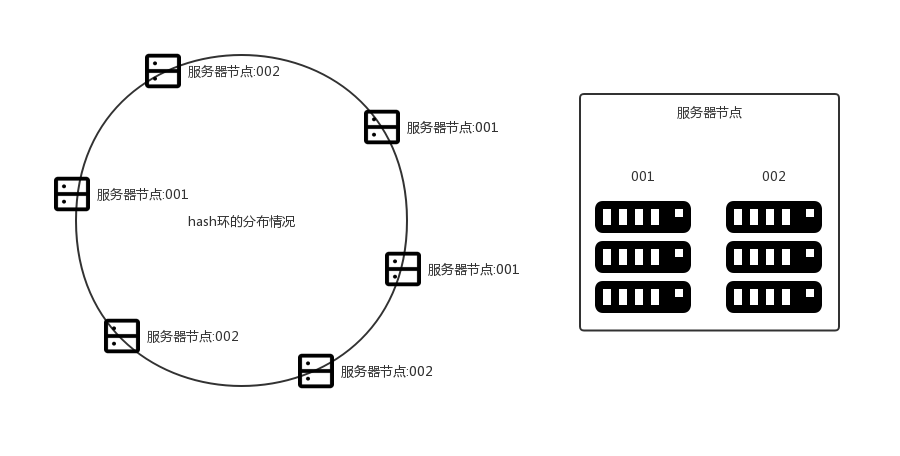
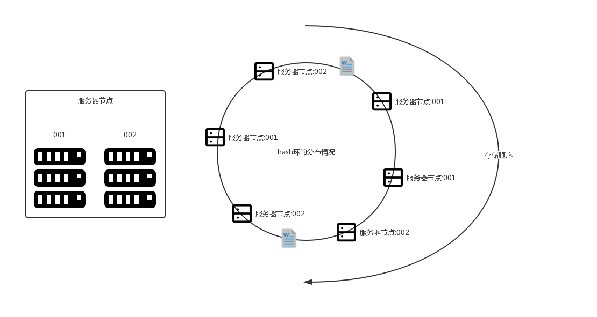

> ## 一致性hash算法

* 一致性Hash算法可以运用于
  * 分布式数据存储
  * 分布式缓存
  * 等领域
* 她带来的好处有
  * 相对于直接hash存储一致性hash算法跟具扩展性
    * 直接hash取余存储会导致动态扩展节点大量数据失效导致雪崩
  * 一致性hash算法每添加一个节点受影响的只有：1/节点数 台服务器

> #### 下面是一致性hash的hash环分布情况

* 将两台服务器生成虚拟化主机，然后将虚拟机hash到环中
* 由于hash的特性实际节点的分布式情况并不是会很理想，但是我们可以尽可能的控制虚拟节点的数量

> #### hash环存储数据

