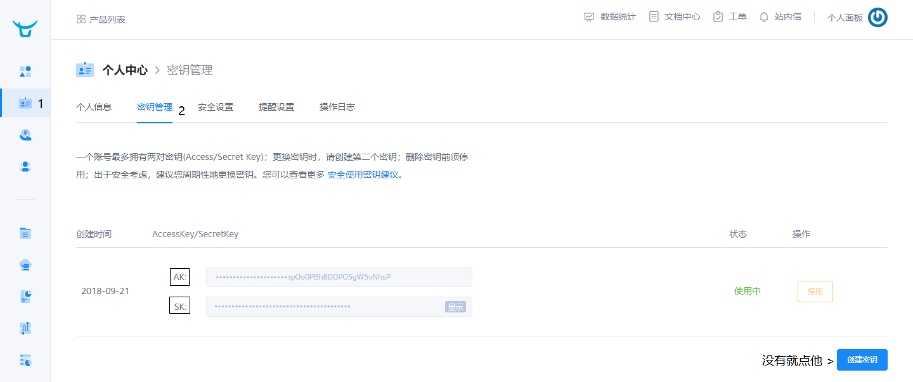

> ### 七牛云CDN

1. [七牛云官网](https://portal.qiniu.com) 下载官方 [SDK](https://developer.qiniu.com/sdk)
2. 在官网 控制台创建 CDN 存储空间
3. 将 SDK jar 包导入完成后找到 : java-sdk-X.x.xx`\`examples`\`upload.java

> 在官网 控制台创建 CDN 存储空间

> 将 SDK jar 包导入完成后找到 : java-sdk-X.x.xx`\` examples`\`upload.java

> examples 下定义了很多操作的 案例这里我只试一个上传 : 需要更改的地方有

1. String ACCESS_KEY = "Access_Key";
2. String SECRET_KEY = "Secret_Key";
3. String bucketname = "Bucket_Name"; 之前创建的存储空间
4.  String key = "my-java.png"; 上传到七牛后保存的文件名
5. String FilePath = "/.../..."; 上传文件的路径
6. 执行 main 方法 OK

> 注意: 执行 main 方法的时候抛出了异常

1. 检查你的电脑网络是否畅通
2. 检查jar包是否版本过低:
   1. gson-2.8.2.jar
   2. happy-dns-java-0.1.4.jar
   3. okhttp-2.3.0-SNAPSHOT.jar
   4. okhttp-3.4.1.jar
   5. okio-1.6.0.jar